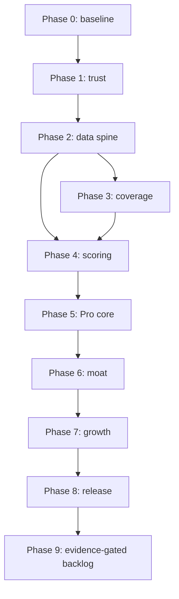

# Instela Market-Ready Master Implementation Plan

**Version:** 1.0  
**Prepared:** September 23, 2026  
**Product spelling used in this document:** Instela  
**Primary source:** *Instela: Market Research, Data Strategy, and a Free vs Pro Plan* (September 21, 2026)  
**Purpose:** A self-contained, phase-by-phase execution specification that Claude Code can run one prompt ID at a time to take Instela from its report-audited state to a market-ready, sellable SaaS.

---

## 1. Authority and evidence boundary

This plan is derived **only** from the supplied market-research report. It does not introduce a different market thesis, target customer, product category, pricing strategy, vertical sequence, or competitive position.

The report's recommendations are treated as the product authority:

1. Keep discovery free; sell speed, odds, and saved effort.
2. Make verified freshness the moat.
3. Repair trust-breaking data and product issues before adding features.
4. Expand scholarships through AcademicWorks and internships through Workday, with USAJOBS Pathways next.
5. Keep launch pricing low and transparent, bill by student-friendly periods, and make cancellation/refunds clear.
6. Launch one adjacent vertical next: business, supported by Workday and finance/consulting boards.
7. Do not build mass auto-submit, scrape prohibited platforms, disguise aggregator data as verified, sell student data, paywall safety, or show unsupported win probabilities.

The report is a market and product specification, not a repository inspection. Therefore:

- Any statement about the **current repository** must be verified by Claude Code before changes are made.
- The report's September 21, 2026 live-site counts are baselines to remeasure, not values to hard-code.
- When repository reality differs from the report, preserve the report's intended outcome, document the mismatch, and ask for direction only if it materially changes product behavior.
- Open legal/access questions in the report remain gates. Code must not quietly bypass them.
- Standard engineering work such as migrations, tests, logging, idempotency, access control, rollback, and staging validation is included only to implement the report safely; it is not a new market recommendation.

### Report references used throughout

| Reference | Meaning |
|---|---|
| R1 | Section 1: five big calls |
| R2 | Section 2: live-site audit and trust leaks |
| R3 | Section 3: demand signals |
| R4 | Section 4: competitor landscape and market gap |
| R5 | Section 5: ranked feature demand |
| R6 | Section 6: data sources |
| R7 | Section 7: pipeline, freshness, parsing, eligibility, scoring, ranking, prediction, outcomes, GitHub scaling |
| R8 | Section 8: Free vs Pro feature split and pricing |
| R9 | Section 9: build/skip/grow and positioning |
| R10 | Section 10: Now/Next/Later roadmap |
| R11 | Section 11: AcademicWorks, Workday, and trust-fix implementation steps |
| RA | Appendix: open questions and sources |

---

## 2. The product this plan is building

Instela becomes a student-priced opportunity operating system with this market position:

> **Internships the day they open. Scholarships you can actually win.**  
> Every listing checked at the source. Student data is never sold.

That wording is a report-proposed starting point, not permanent copy. It must be tested with students before final selection.

### The free product must deliver a real first-session win

A new user can search every listing, enter four profile facts, see a useful set of eligible and fresh matches, understand basic fit and competition labels, save opportunities, receive deadline reminders, and use each application tool once per month. Discovery, eligibility, scam/marketing warnings, work-authorization information, and safety are never paywalled.

### Pro must sell three concrete advantages

| Paid value | What Pro provides |
|---|---|
| Speed | Instant new-listing alerts, complete Opening Soon calendar, and company watchlists |
| Odds | Full fit/competition explanations, gap-closing guidance, and a Low Competition Only filter |
| Saved effort | Unlimited generation/critique tools, essay answer bank, unlimited/automated tracking, weekly triage, verified autofill when ready, and semester recaps |

### “Market-ready and sellable” means

Instela is ready for a controlled production launch only when all of the following are true:

- The report's eight live-site trust issues are fixed and regression-tested.
- Open-listing term unknowns are below 25%; no open row exposes an ended term; no award displays a false `$0`.
- No user sees a fit label before the required four profile fields exist.
- Removed listings follow the two-successful-miss rule, failures never count as misses, and reopen events are logged.
- AcademicWorks starts with 50 approved school portals and Workday with 100 approved employers, each passing the report's stability and sample-validation gates.
- USAJOBS Pathways is represented as a Government category.
- Every live listing is traceable to its source; discovery-only data is never labeled verified.
- Structured eligibility, competition, trust, fit, timing, and value feed one explainable ranking system with the exact initial formula specified in the report.
- Free weekly digests and Pro instant alerts work end to end without duplicates.
- Server-side entitlements and Stripe billing support the report's monthly, semester, and annual offers, seven-day trial triggers, seven-day refund promise, and one-click cancellation.
- The Free vs Pro surface is consistent everywhere.
- Opening Soon and watchlists are based on stored first-seen history and are clearly labeled as estimates.
- Analytics can measure activation, day-7 return, alert click-through, day-35 conversion, and seasonal churn.
- Privacy and product copy make no unsupported claim, never promise win probability, and state that Instela does not sell student data.
- The final release gate passes on staging before any production release.

---

## 3. How to use this file with Claude Code

### Command syntax

Give Claude Code this entire file once. Then invoke one unit with:

```text
Run INS-001 from INSTELA_MARKET_READY_MASTER_IMPLEMENTATION_PLAN.md.
```

After it finishes and the exit criteria pass, continue with the next eligible ID:

```text
Run INS-002.
```

To ask Claude Code to validate a completed unit without rebuilding it:

```text
Audit INS-006 against its acceptance criteria. Fix only failures within that prompt's scope.
```

### Global execution contract for every prompt ID

Claude Code must follow these rules every time an `INS-###` prompt is invoked:

1. **Read local instructions first.** Read `CLAUDE.md`, repository README files, the existing roadmap (including `scholarship-platform-roadmap.md` if present), package scripts, migration conventions, test conventions, and deployment documentation before editing.
2. **Check the dependency gate.** Confirm every listed dependency is complete in code and migrations, not merely marked complete in prose. If a dependency is missing, stop and name the exact missing artifact/test.
3. **Inspect before designing.** Locate the real frontend, backend, database, scheduled-job, authentication, email, billing, and test patterns. Reuse established abstractions and naming.
4. **Preserve unrelated work.** Do not rewrite or revert unrelated files. Do not change product behavior outside the invoked prompt.
5. **Write or update tests first where practical.** Use real anonymized rows as fixtures when the prompt concerns parsing, ranking, state transitions, or ingestion.
6. **Use safe migrations.** Prefer additive schema changes, deterministic backfills, indexes for new query paths, and explicit rollback notes. Do not destroy original raw values or provenance.
7. **Keep secrets server-side.** Never commit tokens, API keys, Stripe secrets, signing secrets, or personal data. Use the repository's secret/environment mechanism.
8. **Make workers idempotent.** Re-running an ingestion, webhook, notification, or backfill must not duplicate listings, charges, messages, or events.
9. **Keep report language honest.** Estimates must be labeled as estimates. Heuristics must not be presented as probabilities. Unverified rows must not appear verified.
10. **Respect source access.** Check and record robots/terms/access approval before activating a scraped source; identify the crawler; throttle as specified; stop on blocking or request.
11. **Do not deploy by default.** Ordinary implementation IDs may edit and test locally and may prepare a staging release, but may not push, merge, change production data, activate billing, or deploy. Only the three release prompts (INS-011A, INS-036A, INS-055) authorize a deployment. Each must open with the yes/no confirmation popup described in Section 3A, and each still requires a named target and successful preflight. **See Section 3A** for what counts as "live" before any deploy happens.
12. **Do not silently commit.** Show the changed files and diff summary. Commit only when the user asks or repository instructions explicitly require it.
13. **Report evidence, not confidence.** End with test commands/results, migration/backfill results, sampled records, screenshots or route/API examples when relevant, remaining risks, and a PASS/BLOCKED status for each acceptance criterion.
14. **Update the execution ledger.** If `docs/instela-market-ready/execution-ledger.md` exists, record the prompt ID, date, files/migrations touched, evidence, unresolved issues, and rollback note.

### Required completion response format

Claude Code must finish each ID with:

```text
INS-### STATUS: PASS | PARTIAL | BLOCKED

Implemented:
- ...

Evidence:
- Test command: ... -> result
- Migration/backfill: ... -> result
- Manual/sample check: ... -> result

Acceptance criteria:
- [x] ...
- [ ] ... (exact reason)

Changed files:
- path — purpose

Data/schema/config changes:
- ...

Rollback:
- ...

Risks or follow-ups:
- ...

Next eligible prompt:
- INS-###
```

If an acceptance criterion is not demonstrated, status cannot be `PASS`.

---

## 3A. Publishing policy: what goes live, and when

**Added 2026-09-23 from a working session with the owner. The three-release structure and the confirmation popup were confirmed by the owner the same day. Items still marked PENDING have been recommended but not yet confirmed.** Nothing is pushed to `master`, merged, or deployed except by a release prompt, after the owner answers yes to that prompt's popup.

### Three different actions, three different effects

| Action | When | Effect on the live site |
|---|---|---|
| **Commit** (local git history) | After each INS prompt | None |
| **Push a working branch** to GitHub (PENDING) | Whenever a backup is wanted | None. Verified 2026-09-23: no workflow in `.github/workflows` triggers on `push` or `pull_request`, and `schedule` triggers run only from the default branch. |
| **Merge to `master` and deploy** | Only at a release (below) | This is what goes live. |

### Three releases, each its own prompt (confirmed)

The work goes live in three releases that match Section 6's milestones. Each release is a dedicated prompt ID. No other prompt may push to `master`, merge, deploy, run a live migration or backfill, or change a live feature flag.

| Release | Prompt ID and when to run it | What it publishes | Gate |
|---|---|---|---|
| **A** | **INS-011A**, after INS-011 | The trust-sprint fixes, which correct things that are wrong on the live site today (terms, amounts, fit labels, marketing awards, one Free limit, dev unlock) | Phase 1 gate (`phase-1-trust-gate.md`) PASS, plus a live smoke check |
| **B** | **INS-036A**, after INS-036 and after INS-051 through INS-054 have been run against the Phase 1-5 scope | Controlled paid beta: coverage, ranking, alerts, and billing. Later features stay hidden or labeled coming soon. | Phase 5 gate PASS plus the scoped INS-051 through INS-054 results |
| **C** | **INS-055**, after INS-054 `GO` | The full report-backed release through Phase 8 | INS-054 as written |

INS-054 and INS-055 as written describe Release C. INS-011A and INS-036A use a scoped copy of the same checklist covering only what has been built by then.

### The confirmation popup (confirmed)

Every release prompt (INS-011A, INS-036A, INS-055) works in this order:

1. **Check preconditions first.** Confirm the gates the release depends on are PASS and their evidence exists. If a gate is not PASS, stop as BLOCKED and do not show the popup, because there is nothing to approve.
2. **Show the popup, using the AskUserQuestion tool, before any live change.** The question must say plainly that this prompt pushes live changes to instela.org, and must state: the release name, the production target (instela.org, and the Vercel and Supabase projects behind it), which prompts' changes are included, the migrations and backfills that will run, the feature-flag defaults, the gate status, and the rollback path. The options are **Yes, publish to the live site** and **No, do not publish**.
3. **Only an explicit Yes proceeds.** A No, a dismissed popup, no answer, or a session that cannot show the popup all mean stop: change nothing live and report the prompt as DECLINED or BLOCKED.
4. **A Yes covers that one release only.** It never carries over to another release prompt or to a later re-run.
5. **A No does not block later prompts.** Building continues, and the release prompt can be run again when the owner is ready.
6. After a Yes, follow the numbered release steps in INS-055, scoped to what that release includes.

### Rules that hold for every release and every day in between

1. **Never merge to `master` or deploy except from a release prompt, after the owner answers yes to its popup.** This applies to A, B, and C alike.
2. **Until a separate staging database exists, every migration or backfill counts as a live change.** Local `.env` and Vercel point at the same Supabase project (`FIXES.md` section 2, sign-in entry). A backfill run from a dev machine changes what the live site shows immediately, and the deployed code will read the rewritten rows. Run none against the live database except as part of a release the owner approved.
3. **Preview deployments also touch live data.** The Preview environment variables were set to the same Supabase project during the sign-in fix.
4. **Pushing to `master` changes live behavior even without a website deploy.** The scheduled ingest, link-check, and alert workflows run `master`'s code against the live database.
5. **Unverified:** whether a push to `master` also auto-deploys the site. `.vercel/project.json` exists and past deploys used the Vercel CLI, but Vercel's Git integration has not been inspected. INS-001 item 8 must settle this before Release A.
6. **"Until INS-055" elsewhere in this file means "until the release prompt that ships that feature."** For example, live Stripe (INS-032, INS-033) and production alerts (INS-030, INS-031) stay off until Release B (INS-036A), because that is the first release that includes them.

### Before Release A (PENDING owner action)

- **Create a staging environment:** a second Supabase project plus a Vercel preview environment pointed at it, so migrations and backfills are rehearsed there and applied to live only at a release. Only the owner can create the Supabase project. **Fallback if declined:** keep every migration additive, and run backfills against the live database only when the owner says so.
- Record how a production release is actually triggered (see rule 5). Tracked in `FIXES.md` section 7, "There is no staging environment".

### Branch and commit policy (PENDING owner yes)

- Work on a long-lived `market-ready` branch, not `master`.
- Commit after each INS prompt. Follow `CLAUDE.md`: flip the roadmap or `FIXES.md` checkbox in the same commit, with a long commit message that explains why (`HANDOFF.md` section 9).
- Push the branch to GitHub as a backup. Merge to `master` only at an approved release.
- Until the owner confirms, changes stay uncommitted and unpushed, as rule 12 in Section 3 says.

---

## 4. Phase map and critical path

The timing below follows the report's two-week trust sprint, 30-60 day Coverage + Pro core, and 60-120 day moat windows. It is sequencing guidance, not a promise independent of repository condition or team capacity.

| Phase | Prompt IDs | Target window | Outcome | Exit gate |
|---|---:|---:|---|---|
| 0. Baseline and execution control | INS-001–003 | Days 1-3 | Repository map, repeatable baseline, safe test/release controls | INS-003 |
| 1. Trust sprint | INS-004–011 | Weeks 1-2 | All eight live-site trust leaks fixed | INS-011 |
| 2. Verified-data spine | INS-012–015 | Weeks 3-4 | Shared ingestion contract, provenance, cadence, and run observability | INS-015 |
| 3. Coverage expansion | INS-016–023 | Days 15-60 | AcademicWorks, Workday, USAJOBS Pathways | INS-023 |
| 4. Eligibility, competition, and ranking | INS-024–028 | Days 25-60 | Explainable “non-saturated” personalized feed | INS-028 |
| 5. Free/Pro, alerts, and billing | INS-029–036 | Days 30-60 | Sellable plans, weekly vs instant alerts, honest upgrade moments | INS-036 |
| 6. Historical moat and saved effort | INS-037–043 | Days 60-120 | Opening Soon, watchlists, answer bank, automated tracking, outcome loop | INS-043 |
| 7. Business launch and growth hooks | INS-044–050 | Days 75-120 | One new vertical, proprietary SEO, referrals, community and campus loops | INS-050 |
| 8. Market-readiness and production release | INS-051–055 | Final launch window | Instrumented, audited, staged, and explicitly released product | INS-055 |
| 9. Post-launch report backlog | INS-056–063 | After first evidence windows / as approvals arrive | Verified autofill, conditional source expansion, calibration, price test, and B2B2C discovery | Per-prompt gates; non-blocking |

### High-level dependency flow



Within a phase, prompts are sequential unless the individual prompt says otherwise. Phase gates are intentionally strict: do not compensate for failed trust or data-quality work with more features.

### Why this sequence follows the research

| Phase | Report-backed reason for its position |
|---|---|
| 0. Baseline/control | The report's site audit is a September 21, 2026 snapshot. Before changing a live SaaS, the same conditions must be remeasured and made reproducible so progress is evidence-based rather than assumed. |
| 1. Trust sprint | The report says stale/incorrect data is the category's most damaging complaint and identifies direct contradictions of Instela's freshness promise: 86% unknown terms, impossible past terms, inflated program totals, profile-free Strong Fit, marketing awards, inconsistent limits, a dev unlock, and insider copy. It explicitly ranks these above new features. |
| 2. Data spine | The strategic moat is verified freshness. The report's rule is “discover wide, verify at the source,” and its pipeline/lifecycle/cadence rules are what let coverage grow without importing competitors' stale-data problem. |
| 3. Coverage | AcademicWorks provides repeatable, university-curated scholarship structure; Workday covers roughly 39% of the Fortune 500 and about 38% of top finance employers according to the report; USAJOBS adds official federal student opportunities. Those sources directly support scholarship trust and the next Business vertical. |
| 4. Scoring | Students report that they cannot find accurate eligibility and often assume they will not win. The report's market gap is odds/competition rather than another keyword list, so structured eligibility and Competition must precede paid upsells around those benefits. |
| 5. Pro core | Rolling review makes early alerts valuable, while competitors charge roughly $29-$40/month and draw criticism for hidden pricing, poor trials/refunds, and cancellation. The report therefore sells instant speed at $5.99 with public terms after the feed is trustworthy. |
| 6. Historical moat | First-seen history compounds over recruiting cycles and cannot be copied quickly. The report also says 21% of non-applying families find the process too effortful, supporting the answer bank, tracking automation, and weekly plan after the core alerts/odds product works. |
| 7. Growth/Business | The report says to launch Business next, not several verticals, and ties it to Workday. Its preferred growth hooks—proprietary history pages, delayed community alerts, referrals, recaps, and a Utah pilot—reuse the product's real data rather than buying reach with unsupported claims. |
| 8. Release/measurement | The report notes typical freemium conversion is modest (about 2-5%, with RevenueCat's cited day-35 median around 2.1%), so distribution and measurement matter as much as feature count. The release must measure activation, retention, alert response, conversion, and seasonal churn. |
| 9. Post-launch backlog | The report conditions these items on proof that does not exist at initial launch: verified autofill, enough unsupported-ATS demand, source permission, a few hundred outcomes, sustained quality before a price test, or validated institutional demand. They are executable IDs, but not launch claims. |

### Research anchors inherited from the report

This file does not independently re-research or update the report's evidence. It carries forward these cited anchors solely as the report summarized them:

| Decision supported | Evidence summarized in the report | Report appendix source families |
|---|---|---|
| Prioritize internships, freshness, and early alerts | Employers planned 3.9% more interns; rolling review rewards early action; the broader entry market remained tight | NACE 2026 reports; Handshake/Class of 2026 reporting; CNBC/Inside Higher Ed summaries |
| Make eligibility/odds/effort visible | Half of families were unaware of scholarships, 32% doubted they would win, and 21% found applications too effortful | Sallie Mae *How America Pays for College 2024* and scholarship-statistics sources cited by the report |
| Treat freshness/privacy as differentiation | Older databases draw stale-listing complaints; no-essay lead-generation models create trust/privacy concerns | Competitor reviews; Scholarships360 vetting criteria; reporting on scholarship data collection |
| Add AcademicWorks and Workday | AcademicWorks exposes repeated university-curated external-opportunity structures; Workday has large Fortune 500/finance presence | AcademicWorks example portals; Jobscan and Resume Genius ATS market-share research cited by the report |
| Keep discovery free and Pro inexpensive/transparent | Scholarship search is usually free; paid job tools sell automation/matching around $29-$40 and receive billing complaints | Product help/review sources for ScholarshipOwl, Simplify, Jobright, Teal, Huntr, Scholly, and others listed in the report |
| Measure conversion rather than assume it | The report cites a roughly 2.1% day-35 freemium median and broader 2-5% typical range | RevenueCat 2026 and subscription-pricing benchmark sources cited by the report |

If any of these facts will be published externally or used for a later pricing/market claim, re-verify it at that time; the report itself marks several prices and access terms as changeable/open questions.

---

## 5. Non-negotiable product and data contracts

These are repeated here so individual implementations do not drift.

### 5.1 Listing lifecycle

```text
Discover -> Resolve -> Verify -> Normalize -> Enrich -> Score -> Rank -> Notify -> Recheck
```

- **Discover:** candidate sources may come from aggregators/community lists.
- **Resolve:** every candidate maps to an employer ATS or sponsor page.
- **Verify:** only successfully fetched source-of-truth rows count as live.
- **Normalize:** one shared schema stores opportunity facts and provenance.
- **Enrich:** extracted fields keep source evidence and confidence.
- **Score/Rank:** separate scores are explained; hard eligibility is applied first.
- **Notify:** Free weekly, Pro instant, deadline reminders for everyone.
- **Recheck:** successful polls can advance miss state; failed polls cannot.

### 5.2 Minimum normalized fields

Every opportunity needs a representation for:

- stable internal ID and source-specific external ID/key;
- type: internship or scholarship;
- title and organization/sponsor;
- canonical apply URL and source URL;
- source/provider and verification state;
- raw payload/text reference or retained source snapshot as repository policy allows;
- discovered/first-seen, last-seen, confirmed, first-missed, closed, and reopened timestamps where applicable;
- term plus `term_source = explicit | inferred | unknown`;
- location and remote/on-site attributes;
- deadline;
- `amount_per_award`, `awards_count`, `program_total`, and `amount_status = exact | range | varies | unparseable`;
- structured eligibility plus exact source evidence and confidence per constraint;
- sponsor type, marketing/lottery signals, corroboration count;
- Fit, Competition, Timing, Value, and Trust scores plus explanation factors;
- ingestion/source registry reference and last successful poll run.

Do not force every concept into one table if the existing architecture uses normalized child tables or JSON columns. Preserve the semantics.

### 5.3 Closure rule

- Start with `K = 2` consecutive **successful** polls in which a previously present row is missing.
- Set `closed_at` to the first missed poll's time.
- Never re-close a row already closed.
- If it reappears, reopen it and log the event.
- Timeout, 5xx, parse failure, blocking, or other failed polls never count as a miss.

### 5.4 Ranking formula

```text
if ineligible and hide_ineligible: exclude

score = 0.35 * Fit
      + 0.25 * (100 - Competition)
      + 0.20 * Timing
      + 0.10 * Value
      + 0.10 * Trust
```

- Keep weights in configuration, initially set exactly as above.
- Internship Timing decays over roughly 14 days from first seen.
- Scholarship Timing peaks with 7-45 days until deadline.
- Value is log-scaled award value or pay.
- Show the top three reasons.
- No more than three opportunities of the same sponsor type in the top ten.
- Never place an unverified row above an otherwise eligible verified row.
- Lottery-style awards receive no Competition score and live on a labeled separate shelf.

### 5.5 Free and Pro contract

| Feature | Free: See it | Pro: Apply |
|---|---|---|
| Search and filters | Unlimited, all listings | Unlimited, all listings |
| Ranked matches | Top 20 per day | Full list |
| Fit | Label | Full explanation + gap closer |
| Competition | Low/Medium/High label | Breakdown + Low Competition Only filter |
| Alerts | Weekly digest | Instant, within minutes of appearance |
| Opening Soon | Next 7 days | Full calendar + watchlist |
| Saved items/deadline reminders | Included | Included |
| Safety, marketing, eligibility flags | Included | Included |
| Tracker | 10 items | Unlimited + email-forward automation |
| Resume, cover letter, LinkedIn, GitHub, essay tools | One use of each per month | Unlimited |
| Essay answer bank | Not included | Included |
| Weekly triage | Not included | Five best applications that week |
| Autofill/apply | Not included | Included only after end-to-end verification |
| Semester recap | Not included | Included and shareable |

### 5.6 Launch pricing contract

- Monthly: **$5.99**.
- Semester Pass: **$19.99 for four months**.
- Annual: **$39.99**.
- Seven days of Pro, offered only at specified high-intent moments.
- Seven-day, no-questions refund window.
- One-click cancellation and public pricing.
- `$7.99/month` is a later experiment only after data-quality fixes; it is not launch pricing.

---

# PHASE 0 — Baseline and execution control

## INS-001 — Map the real system and create the execution ledger

**Report basis:** The entire report, especially R2, R7, R8, and R10.  
**Depends on:** None.  
**Type:** Inspection and documentation; no product behavior change.  
**Outcome:** A verified map of the repository so every later prompt touches the correct systems.

### Claude Code execution prompt

Read the global execution contract in this file and all repository instructions. Do not change product behavior in this task.

Inspect the repository and document:

1. Frontend framework, routes, pages, components, state/query layer, design system, and tests.
2. Backend/runtime framework, public and internal APIs, job/worker entry points, scheduled workflows, queues, and tests.
3. Database technology, migration mechanism, generated types, row-level security/access policies, and seeds/fixtures.
4. Current opportunity schema and how internships and scholarships differ.
5. Current source adapters, polling cadence, run logging, normalization, enrichment, close/reopen behavior, and freshness badges.
6. Current profile fields, match/fit logic, filters, ranking, saved items, application tracker, generation tools, and GitHub audit.
7. Current authentication, account/plan fields, dev unlock mechanism, feature gates, billing placeholders, email provider, and analytics.
8. Production/staging configuration and documented release commands. Record them; do not deploy.
9. The location of every implementation implicated by the eight issues in R2.
10. Existing work that already satisfies any later prompt, with exact file/test evidence.

Create or update:

- `docs/instela-market-ready/system-map.md`
- `docs/instela-market-ready/execution-ledger.md`
- `docs/instela-market-ready/report-requirements-traceability.md`

The traceability document must map every R2 issue, every R7 system rule, every R8 feature split, every R9 build/skip rule, every R10 roadmap item, and every RA open question to one or more `INS-###` IDs and an initial state of `not started`, `already satisfied`, `partial`, `blocked`, or `not launch-blocking`.

### Acceptance criteria

- The system map names real paths and commands, not guessed architecture.
- All eight R2 issues have code/data locations or a documented missing implementation.
- Every later prompt has an identified likely subsystem or an explicit `not present` result.
- The ledger contains a row for INS-001 through INS-063, plus INS-011A and INS-036A, with INS-056 through INS-063 marked post-launch/non-blocking.
- No application behavior, schema, dependency, secret, production data, or deployment changed.

---

## INS-002 — Establish the repeatable data-quality and product baseline

**Report basis:** R2 baseline counts and issues; R7.3-R7.9; R10 trust-sprint targets; R11.3 done criteria.  
**Depends on:** INS-001.  
**Type:** Diagnostics plus safe read-only reporting utilities.  
**Outcome:** Current measurements replace the report's snapshot without changing its strategy.

### Claude Code execution prompt

Build a repeatable, non-destructive baseline audit using the repository's established scripting/query conventions. It must be runnable against local/test data and, only with explicit environment configuration, against a read-only production connection.

Measure and report at minimum:

1. Open listings, total tracked listings, and listings first seen in the last 24 hours.
2. Open listings with `unknown`/missing term and percentage.
3. Open listings with a term whose end is in the past; group by term.
4. Awards displayed or stored as zero, malformed amount candidates such as `$,000`, and likely program totals mistaken for per-award amounts.
5. Fit labels shown or generated for profiles missing any of major, graduation year, state, or work authorization.
6. Marketing/law-firm/rehab/SEO awards in the first 10 default results, including sponsor classification and position.
7. Every UI/API copy location that states the Free ranked-match limit and the number used.
8. Whether a public path or client-side state can unlock paid access.
9. Rows closed after a failed poll, rows repeatedly re-closed, and rows whose `closed_at` does not represent the first missed successful poll when history exists.
10. Verified vs unverified rows in the default top results.
11. Current counts by source, last successful poll age, parse/error rate if available, and saved listings with dead apply links if a safe checker already exists.

Use anonymized IDs or aggregates in committed output. Do not commit personal profile data. Store a dated baseline artifact under `docs/instela-market-ready/baselines/` and record the command required to regenerate it.

Where a metric cannot be measured due to missing schema/history, write `not measurable` and name the missing field or event rather than fabricating a zero.

### Acceptance criteria

- One documented command regenerates the baseline.
- The report's eight trust issues each have a current measured result or a precise `not measurable` reason.
- Output distinguishes stored-value defects, API defects, and UI-display defects.
- No production mutation occurs.
- Personal data and secrets are absent from artifacts and logs.

---

## INS-003 — Install the phased validation and rollback harness

**Report basis:** R10 requirement that each stage work before the next begins; R11's tests-first and backfill-count instructions.  
**Depends on:** INS-001 and INS-002.  
**Type:** Test/release infrastructure.  
**Outcome:** Later prompts can prove their changes and roll them out safely.

### Claude Code execution prompt

Using existing repository conventions, create the smallest shared validation harness needed by this plan:

1. Add fixture support for anonymized real rows representing: explicit terms, description-only terms, missing terms, past terms, program totals, exact/range/varies/malformed amounts, ineligible constraints, marketing awards, lottery-style language, rows removed/reappearing, and failed polling.
2. Add a place for phase-gate test suites or scripts without duplicating the primary test framework.
3. Add feature/config switches only where the repository lacks a safe way to stage new rankers, source adapters, notifications, billing, and Opening Soon. Defaults must preserve current production behavior.
4. Document database migration, backfill dry-run, rollback, staging seed, and evidence-capture procedures.
5. Add a redaction rule/helper for source payloads and application/profile fixtures so test artifacts cannot leak student data or secrets.
6. Create `docs/instela-market-ready/release-gates.md` with the exact phase gates from this plan.

Do not add a new framework when the repository already has an appropriate one. Do not add feature flags for simple internal refactors that do not need rollout control.

### Acceptance criteria

- Representative fixtures exist and are used by at least one smoke validation.
- The documented local validation command succeeds.
- New rollout switches, if needed, default safely and are server-controlled for paid/security behavior.
- Dry-run and rollback procedures are documented for data migrations/backfills.
- Phase 0 has no user-facing behavior change.

---

# PHASE 1 — Trust sprint

This phase implements the report's highest-priority instruction: repair the promise before expanding the product. It must finish before new sources or paid features are exposed.

## INS-004 — Add the term model and deterministic term parser

**Report basis:** R2 issues 1-2; R7.4; R10 Now; R11.3.  
**Depends on:** INS-003.  
**Type:** Database, backend/domain logic, tests.  
**Outcome:** Every term is explicit, inferred, or honestly unknown.

### Claude Code execution prompt

Implement the term data contract and parser with tests written from real anonymized rows first.

Required behavior:

1. Add or normalize a `term_source` representation with exactly `explicit`, `inferred`, or `unknown`. Add whatever term year/season structure is consistent with the existing schema.
2. Parse an explicit season + four-digit year from the **title first**, then the description. Support Summer, Fall, Spring, Winter, and Co-op language without treating unrelated years as terms.
3. If no explicit term exists, infer from the listing's own `first_seen`:
   - first seen July through January -> next summer;
   - first seen February through June -> that calendar year's summer.
4. Keep explicit and inferred values distinguishable through storage, API, ranking/filtering, and display.
5. Return `unknown`, never a fabricated term, when inputs are insufficient or ambiguous.
6. Do not overwrite a valid explicit source term with an inference.
7. Make parsing deterministic and independently testable; do not require an LLM for this step.
8. Preserve original raw/source text for audit.

Do not change ranking weights in this prompt. Do not add a dependency unless the existing language/runtime cannot implement the parser; if that exceptional case occurs, stop and justify it before adding anything.

Test year-boundary cases, January/February/June/July boundaries, title-vs-description precedence, multiple term mentions, co-op wording, missing first-seen, and malformed dates. Use the system clock only through an injectable/fixed test mechanism.

### Acceptance criteria

- Schema migration and generated types succeed.
- Parser tests cover every required rule and boundary.
- Existing listing ingestion can populate the new fields without breaking old rows.
- Explicit values always outrank inferred values.
- No UI change is required yet; this prompt must not falsely present inferred values as explicit.

---

## INS-005 — Enforce term sanity, backfill terms, and repair term UX

**Report basis:** R2 issues 1-2; R7.4; R10 Now; R11.3 done criteria.  
**Depends on:** INS-004.  
**Type:** Backfill, backend validation, frontend filters/cards.  
**Outcome:** Open listings have credible terms, and inferred terms are transparent.

### Claude Code execution prompt

Complete term handling end to end:

1. Define term start/end boundaries in one tested domain utility or configuration so “ended” is deterministic.
2. An open listing may not remain normally visible with an ended term. Flag it for priority source recheck; after the normal lifecycle confirms its state, close or correct it according to source truth. Do not silently rewrite an explicit source term merely to make it current.
3. Backfill all tracked rows in batches using INS-004 logic. Make the backfill resumable and idempotent, with dry-run counts for explicit, inferred, unknown, past/open flagged, unchanged, and failed.
4. Return `term_source` through all relevant APIs.
5. Cards/details must render, for example, `Summer 2027 (inferred)` for inferred values and an honest unknown label when unresolved.
6. Add an `Include inferred terms` filter toggle, on by default.
7. Hide past terms from the open-listing term filter unless `Show closed` is enabled.
8. Ensure search/filter URLs and saved preferences remain backwards-compatible or migrate safely.
9. Rerun the INS-002 term metrics after the backfill.

### Acceptance criteria

- Fewer than 25% of open listings have an unknown term.
- No normal open result carries an ended term; any detected exception is quarantined/flagged for source recheck and excluded until resolved.
- Past terms do not appear in the open-only filter.
- Inferred terms are visibly labeled and controllable.
- Backfill can be rerun without changing correct rows or duplicating work.
- Automated tests cover API, filter, card/detail display, and sanity behavior.

---

## INS-006 — Normalize award amounts and repair amount UX

**Report basis:** R2 issue 3 and `$0` parser bug; R7.5; R10 Now; R11.1 and R11.3.  
**Depends on:** INS-003. Can proceed after INS-004, but must finish before INS-011.  
**Type:** Database, parser, backfill, filters, frontend.  
**Outcome:** Per-award amounts are never confused with program totals and unknown does not become zero.

### Claude Code execution prompt

Implement the report's four-field award representation:

- `amount_per_award`
- `awards_count`
- `program_total`
- `amount_status = exact | range | varies | unparseable`

Adapt physical types/table layout to the existing schema while preserving these meanings. Then:

1. Write parser fixtures for exact values, ranges, `Varies`, `$0.00`, malformed `$,000`, program-total language, counts, and approximate language such as “about $450,000 to 225 students.”
2. Parse `$0.00` and `Varies` as no known per-award amount with status `varies`, not as a real zero-dollar award.
3. Parse malformed monetary text as `unparseable`, never `$0`.
4. When total and count are present, store both and compute an estimated per-award amount only under an explicit, tested estimate rule. Preserve the total and mark/display the per-award result as estimated.
5. Never infer that a large number is a per-award amount solely because it has a currency symbol.
6. Backfill existing scholarship rows idempotently and retain original text/provenance.
7. Change the minimum-award filter so unknown/unparseable amounts are excluded by default when a minimum is selected, with an `Include unknown amounts` control.
8. Update cards/details to show honest combinations such as `$2,000 (est.) · about 225 awards a year`, ranges, `Amount varies`, or `Amount not stated`.
9. Audit sorting/ranking value inputs so unknown is not treated as zero or as a high value.

### Acceptance criteria

- No listing displays `$0` as an award amount due to missing, varies, or malformed source data.
- Known program totals are not displayed as single-recipient awards.
- Minimum-amount filter behavior matches the report.
- Backfill produces counts by status and a review sample containing the AIEF/Mensa-style cases described in R2 if analogous rows exist.
- Parser, API, filter, rank-input, and UI tests pass.

---

## INS-007 — Replace closeRemoved with the two-successful-miss lifecycle

**Report basis:** R2 closeRemoved bug; R7.2-R7.3; R10 Now.  
**Depends on:** INS-003.  
**Type:** Ingestion lifecycle, schema/history, tests.  
**Outcome:** Temporary failures do not close good listings, and reopening is observable.

### Claude Code execution prompt

Find every source adapter and shared helper that can close or reopen listings. Replace inconsistent behavior with the canonical lifecycle in Section 5.3 of this plan.

Implementation requirements:

1. Record whether a poll completed successfully enough for absence to be meaningful. A timeout, network error, 5xx, block/403, partial pagination, parser failure, or validation failure is not a successful complete poll.
2. For a row present on the previous successful complete poll and absent now, record first-miss time and miss count 1; keep it open.
3. Close only at miss count 2, and set `closed_at` to the first-miss time.
4. Do not increment miss counts more than once for the same logical poll/run.
5. A present row resets pending misses.
6. An already closed row is not re-closed or given a new closure timestamp merely because it remains absent.
7. If a closed row returns, reopen it, clear/resolve close state as designed, and append an auditable reopen event.
8. Apply shared logic to internships and scholarships, with source adapters reporting complete/failed status accurately.
9. Provide a safe migration for rows whose current state can be corrected from retained run history. Do not invent first-miss timestamps where history is absent.

Build state-transition tests for present -> miss 1 -> miss 2 -> closed; present -> failed poll -> present; partial pagination; duplicate run delivery; closed -> still absent; and closed -> reappears.

### Acceptance criteria

- `K = 2` is configurable but initially two for both opportunity types.
- Only two consecutive successful complete misses close a row.
- `closed_at` represents the first miss.
- Failed/partial polls do not advance misses.
- Reappearing rows reopen exactly once and log an event.
- The original re-closing regression has a permanent test.

---

## INS-008 — Gate fit labels behind the four-field profile minimum

**Report basis:** R2 issue 4; R7.6; R9 activation metric; R10 Now; R11.3.  
**Depends on:** INS-003.  
**Type:** Profile/API/ranking/frontend.  
**Outcome:** “Strong Fit” always means the result was evaluated against an actual student profile.

### Claude Code execution prompt

Implement one shared profile-readiness rule requiring:

1. major;
2. graduation year;
3. state;
4. work authorization.

Then enforce it server-side and client-side:

- Until all four exist, no match/fit label such as Strong Fit, Good Fit, or percentage-like output may be generated or returned.
- Show one consistent CTA: `Add 4 details to score your feed`, dynamically showing remaining fields if the existing UX supports it without changing the promise.
- The CTA must route to a focused profile-completion flow and return the user to the feed.
- A `prefer not to say` or missing value is not treated as a positive match. Where evaluation is possible but a constraint/profile value is unknown, show `Check eligibility`, not Strong Fit.
- In this trust sprint, hard-gate only clearly structured, high-confidence location and education-level conflicts already available in the data. Full extraction comes in INS-024.
- Keep eligibility/safety information available to Free users.
- Emit the activation event only when the four fields are complete and the user makes at least one save, matching R9's activation definition.

### Acceptance criteria

- No API or UI path exposes a fit label without all four fields.
- Anonymous, new, partial, and `prefer not to say` profiles have tests.
- High-confidence state/county/school and education-level conflicts cannot be labeled Strong Fit.
- The completion CTA works on mobile and desktop and preserves the user's return path.
- The activation event requires four fields plus one save.

---

## INS-009 — Detect and down-rank marketing awards; separate lottery-style awards

**Report basis:** R2 issue 5; R7.7-R7.8; R9 safety/positioning.  
**Depends on:** INS-003 and INS-006.  
**Type:** Classification, trust scoring, ranking, UI.  
**Outcome:** Default results no longer reward SEO/lead-generation awards, while warnings remain transparent and free.

### Claude Code execution prompt

Implement a transparent v1 sponsor/trust classifier using the report's signals. Do not silently delete suspicious awards.

Signals to represent, with provenance when observable:

- third-party account required to apply;
- no essay and almost no requirements;
- sweepstakes/lottery language;
- sponsor primarily sells unrelated services and appears to use the award for links/lead generation, especially law firms, rehab centers, and SEO sites;
- no evidence of a winner in the prior 12 months;
- no contact information;
- ad-heavy page;
- corroboration across independent university portals, which raises trust.

Requirements:

1. Classify sponsor type and compute a configurable Trust score/reasons without presenting it as certainty.
2. Detect lottery-style awards separately. Exclude them from Competition scoring and place them on a clearly labeled `Lottery-style` shelf/section.
3. Down-rank marketing-award patterns in the default sort. Keep a visible badge/reason and allow users to inspect them; do not conceal the safety information behind Pro.
4. Make rules/config reviewable and testable. If an LLM enriches a field, store the source excerpt, confidence, model/version metadata, and allow deterministic overrides.
5. Add fixtures analogous to law-firm, rehab, credible association, and multi-portal corroborated awards.
6. Audit the first 10 default scholarship results after implementation.

### Acceptance criteria

- Marketing/law-firm awards no longer dominate the first default results; the baseline comparison is recorded.
- Lottery-style awards have no misleading Low/Medium/High competition label.
- Every visible warning has at least one stored reason.
- Corroborated awards receive the configured trust boost.
- All safety/trust labels are available to Free users.

---

## INS-010 — Repair plan copy, remove the production dev unlock, and rewrite trust-first messaging

**Report basis:** R2 issues 6-8; R8; R9 positioning; R10 Now.  
**Depends on:** INS-001 and INS-008.  
**Type:** Entitlement security, content, frontend, backend.  
**Outcome:** The public product tells one understandable story and cannot grant paid access in the browser.

### Claude Code execution prompt

Fix the remaining high-trust surface issues:

1. Standardize the Free ranked-match limit to **Top 20 per day** across homepage, pricing, onboarding, product UI, APIs, tests, metadata, FAQs, and emails. Do not implement full usage enforcement here if INS-029 owns it; remove contradictory copy now.
2. Remove public production navigation/routes/buttons titled or functioning as a browser paid-plan unlock.
3. Search for local-storage, cookie, query-param, client-state, or public endpoint paths that can grant a paid role. Paid authorization must ultimately be resolved server-side per authenticated account. If the full entitlement model does not yet exist, default everyone safely to Free and retain a development-only mechanism that cannot compile/route into production.
4. Replace insider-first language on the primary landing journey. Lead with the student outcome, freshness, and privacy. Move ATS mechanics to a `How we verify` explanation.
5. Add the report-proposed hero as one test candidate: `Internships the day they open. Scholarships you can actually win.` Add the subline `Every listing checked at the source. Your data is never sold.` Do not claim it is the winning variant before student testing.
6. Preserve honest disclosures about unfinished features. Do not advertise an unbuilt paid feature as active.
7. Add or update a concise verification-method page explaining source-of-truth fetches, timestamps, inferred fields, and estimates in student language.

### Acceptance criteria

- `20` is the only Free ranked-match number visible in code/content and tests, excluding historical docs.
- No production client action can grant paid access.
- All primary pages explain the outcome before ATS terminology.
- The site states that student data is never sold only if current policy/implementation can support that claim; otherwise status is BLOCKED with the exact conflicting practice.
- Unbuilt features remain honestly labeled.

---

## INS-011 — Run and pass the Trust Sprint release gate

**Report basis:** R2, R10 Now, R11.3 done criteria.  
**Depends on:** INS-004 through INS-010.  
**Type:** Integrated validation; fixes limited to trust-sprint regressions.  
**Outcome:** Objective evidence that the core promise is no longer contradicted by the product.

### Claude Code execution prompt

Run all Phase 1 migrations/backfills against staging-like data using dry-run first. Execute unit, integration, end-to-end, accessibility smoke, and responsive checks relevant to INS-004 through INS-010. Rerun the INS-002 audit and compare before/after.

Manually sample at least:

- 20 open listings across source types for term correctness/source labeling;
- 20 scholarships across amount statuses, including suspected totals/unknowns;
- new, partial, complete, and conflicting profiles;
- the first 10 default scholarship results;
- two successful misses, failed poll, partial poll, and reopen paths;
- production-build navigation and entitlement paths for the removed dev unlock;
- homepage, pricing, cards, filters, and mobile layouts.

Create `docs/instela-market-ready/gates/phase-1-trust-gate.md` with before/after numbers, commands, sample method, screenshots/links if the repo supports them, failures, and rollback instructions.

Do not activate later features or deploy production in this prompt.

### Acceptance criteria

- Unknown term share is below 25% for open listings.
- No normally visible open listing has an ended term.
- No scholarship displays false `$0`; program totals are distinguished.
- No fit label appears without all four profile fields.
- Marketing awards are demonstrably down-ranked; lottery-style awards are separate.
- Free limit copy is consistently 20.
- No production dev unlock or client-side paid grant remains.
- Closure/reopen state tests pass.
- Student-facing primary copy leads with outcomes, freshness, and privacy.
- Every criterion has evidence; otherwise Phase 1 is BLOCKED.

---

## INS-011A — Release A: publish the trust sprint to instela.org

**Report basis:** R2, R10 Now; Section 3A of this file.  
**Depends on:** INS-011 status `PASS`; a staging environment created, or the additive-only fallback accepted by the owner (Section 3A, "Before Release A").  
**Type:** Production migration, deployment, and verification. **One of the three prompts that change the live site.**  
**Outcome:** The eight trust problems are fixed on the live site.

### Claude Code execution prompt

Follow the confirmation-popup procedure in Section 3A exactly.

1. **Preconditions, before any popup.** Confirm INS-011 is `PASS` and `phase-1-trust-gate.md` exists with evidence. Identify the exact branch and commit to release, list the migrations and backfills it contains, and confirm database backup and restore readiness. If anything is missing, stop as BLOCKED without asking.
2. **Show the Section 3A popup.** Nothing live changes until the owner answers Yes.
3. **On Yes,** follow the INS-055 release steps scoped to Phase 1: check the current migration state, run migrations and backfills in the documented order with a dry run first, deploy the exact approved build, and verify. Live billing, alerts, and the Phase 3-6 sources and features do not exist yet and stay off.
4. **Verify on production, read-only.** Rerun the INS-002 audit and compare it to the Phase 1 gate: unknown terms below 25% of open listings, no open result with an ended term, no false `$0`, no fit label without all four profile fields, marketing awards down-ranked, Free limit copy consistently 20, and no browser-side paid unlock.
5. **If any Phase 1 gate threshold is breached,** roll back or disable the implicated change using the rollback steps in the gate document. Do not improvise new thresholds.
6. Write `docs/instela-market-ready/releases/release-a.md` with the release identifier, migrations run, before and after numbers, and the rollback path.

### Acceptance criteria

- The popup was shown and answered Yes before any live change.
- Production matches the approved build and migrations.
- The production audit meets every Phase 1 gate criterion.
- Rollback was available and documented.
- If the answer was No: status DECLINED, nothing live changed, later prompts unaffected.

---

# PHASE 2 — Verified-data spine

This phase turns the report's pipeline into a reusable implementation contract before Instela adds hundreds of new sources. It protects the freshness claim as coverage grows.

## INS-012 — Create the canonical source registry and opportunity provenance model

**Report basis:** R6 discover-wide/verify-at-source rule; R7.1 pipeline; R7.4-R7.8 provenance needs.  
**Depends on:** INS-011.  
**Type:** Data model, internal APIs, admin/config.  
**Outcome:** Every listing and extracted field can be traced to an approved source of truth.

### Claude Code execution prompt

Inspect the existing source configuration and opportunity schema. Extend, rather than replace, working abstractions so the system can represent:

1. A **source registry** record with source/provider type, organization, public board/page URL, source-of-truth status, opportunity type, active/paused/blocked state, poll tier, cadence, terms/robots review status/date/note, crawler contact identity, last successful complete poll, last failure, and adapter configuration that contains no secrets.
2. Candidate/discovery references distinct from verified publication. A Simplify/Adzuna/community discovery hit must not become a live verified listing until its own ATS/sponsor source succeeds.
3. Raw/source provenance sufficient to reproduce normalization and enrichment decisions while respecting storage/privacy policy.
4. Field-level extraction evidence and confidence for term, eligibility, amount, effort, award count, and sponsor type. Deterministic fields may record parser rule/version rather than LLM confidence.
5. First-seen, last-seen, confirmed, close, and reopen timestamps/events without collapsing their meanings.
6. Corroboration relationships showing which independent university portals list the same scholarship.
7. A safe admin/config view or internal inspection command for source state. Do not expose credentials or private payloads.

Migrate existing sources and listings without losing their stable IDs, saved relations, tracker relations, or first-seen history. Where past provenance is unknowable, use an explicit unknown state.

### Acceptance criteria

- Every currently published live row maps to a registry source or is explicitly quarantined for repair.
- Discovery-only candidates cannot pass the verified publication gate.
- Field-level provenance/confidence can be returned to internal inspection tooling.
- Existing user relationships survive migration.
- Schema indexes support source lookup, live-state queries, poll scheduling, and first-seen ranking.

---

## INS-013 — Implement the shared idempotent ingestion state machine

**Report basis:** R6 source-of-truth rule; R7.1; R7.3; R11.1-R11.2 stable reruns.  
**Depends on:** INS-012 and INS-007.  
**Type:** Backend ingestion architecture and tests.  
**Outcome:** Every adapter follows the same publication, update, absence, and failure semantics.

### Claude Code execution prompt

Implement or refactor the shared ingestion path around explicit stages:

```text
Discover -> Resolve -> Verify -> Normalize -> Enrich -> Score -> Rank/Publish -> Notify -> Recheck
```

Requirements:

1. Define typed/domain contracts for adapter fetch results, pagination completeness, raw row identity, normalized opportunity, enrichment status, poll outcome, and lifecycle delta.
2. A poll/run must report `successful_complete`, `successful_no_changes`, `partial`, or `failed` (use repository-appropriate names with equivalent semantics).
3. Normalize/upsert by stable source identity and a documented fallback key. Do not make mutable title text the only identity for internships.
4. Make retry/replay idempotent. The same raw row/run cannot create duplicate opportunities, duplicate lifecycle events, or duplicate notify events.
5. Publish only after source verification and minimum schema validation.
6. Preserve the existing first-seen timestamp on ordinary updates; update last-seen/confirmed appropriately.
7. Route absence through INS-007's two-miss lifecycle, only after complete pagination/success.
8. Queue or mark enrichment/scoring independently so a temporary model failure does not mislabel or delete a verified listing.
9. Emit structured inserted, updated, unchanged, missing-1, closed, reopened, rejected/quarantined, and error counts.
10. Provide adapter contract tests that existing integrations must pass.

### Acceptance criteria

- At least two existing source adapters pass the shared contract tests.
- Replaying the same successful poll produces no duplicates or false changes.
- Partial/failed results cannot close listings.
- First-seen is stable across updates and replays.
- A newly verified row can progress to publication and an idempotent notify event.

---

## INS-014 — Add report-specified polling tiers, saved-link checks, and run observability

**Report basis:** R7.2 refresh cadence; R7.3; R11 logging requirements.  
**Depends on:** INS-013.  
**Type:** Scheduler/workers, observability, internal admin.  
**Outcome:** Freshness is managed deliberately and failures are visible before they damage trust.

### Claude Code execution prompt

Implement configurable scheduling tiers exactly aligned with the report's starting cadences:

| Source/tier | Initial cadence |
|---|---|
| Hot internship boards: top employers or boards with an open intern role | Every 20 minutes |
| Other ATS boards | Configurable 6-24 hours |
| Workday sites | Configurable 6-12 hours; faster only if promoted to hot list safely |
| USAJOBS Pathways | Every 6 hours |
| AcademicWorks portals | Daily |
| Direct scholarship pages | Weekly; daily within 14 days of deadline |
| Saved-item apply/dead-link check | Daily |

Requirements:

1. Use one scheduler source of truth and prevent overlapping duplicate runs per source.
2. Add bounded retries/backoff and host-level concurrency/rate limits.
3. Log start/end, adapter version, pages/rows fetched, completeness, inserted/updated/closed/reopened/quarantined counts, duration, next run, and redacted error category.
4. Alert operators on repeated failure, blocking/403, parse collapse, unusually large close delta, stale successful-poll age, and notification backlog. Use the project's existing alerting path; if none exists, implement an internal health surface and document the missing external destination.
5. Daily saved-link checks must never silently remove a user's saved item. Mark it closed/unavailable with explanation and retain the saved record.
6. Expose a source-health inspection page or command that does not leak secrets.
7. Add a runbook for pausing a source, replaying a safe run, and correcting an adapter.

### Acceptance criteria

- Each source type can be assigned the report cadence without code changes.
- Overlapping/replayed jobs remain idempotent.
- A simulated parse collapse/403 does not close rows and creates an operator-visible alert.
- Saved closed/dead opportunities remain visible to the saver with status.
- Run summaries expose the counts required by R11.

---

## INS-015 — Scale and secure the GitHub audit; pass the data-spine gate

**Report basis:** R2 privacy-first tools; R3 skills-based hiring; R7.12; R10 stage gating.  
**Depends on:** INS-012 through INS-014.  
**Type:** API integration, caching, security, phase validation.  
**Outcome:** GitHub audits cannot exhaust one shared anonymous quota, and the common data platform is proven.

### Claude Code execution prompt

First determine where GitHub audit requests currently execute.

- If they run from the server, use a server-held GitHub token through the established secret mechanism, target the authenticated 5,000-requests/hour allowance described by the report, cache each public profile audit for 24 hours, deduplicate concurrent requests, and batch/reuse calls where the API allows.
- If they run entirely in the student's browser and therefore use per-user unauthenticated limits, document that fact. Add safe rate-limit UX/caching only if needed; do not move it server-side without reason.

In either case:

1. Do not request private-repository scope for the public-profile audit.
2. Do not log access tokens or unnecessary GitHub/profile data.
3. Show rate-limit/temporary failure honestly and preserve a usable cached result.
4. Test cache hit, miss, expiry, concurrent request, rate-limit, invalid user, and upstream failure.

Then run the Phase 2 gate:

- validate every current adapter against the shared run/lifecycle contract or list an explicit migration blocker;
- replay representative polls and prove idempotency;
- prove discovery-only data cannot publish as verified;
- inspect source health/run counts;
- test each schedule tier in a controlled scheduler environment;
- create `docs/instela-market-ready/gates/phase-2-data-spine-gate.md`.

### Acceptance criteria

- GitHub audit rate-limit design matches where calls actually run and includes 24-hour caching where server-shared.
- The source registry, shared ingestion state machine, scheduler, lifecycle, and run observability pass integration tests.
- Existing verified listings remain traceable and saved/tracker relations are intact.
- Phase 2 gate evidence is complete before new source adapters are enabled.

---

# PHASE 3 — Coverage expansion

The report names three immediate/next sources: AcademicWorks for curated scholarship coverage, Workday for the business-oriented employer universe, and USAJOBS Pathways for government internships. Wide discovery never overrides source verification.

## INS-016 — Create the source-access compliance gate and approved seed registries

**Report basis:** R6 access notes; R11.1-R11.2; RA open questions.  
**Depends on:** INS-015.  
**Type:** Source configuration, compliance metadata, discovery tooling.  
**Outcome:** Instela can add 50 AcademicWorks schools and 100 Workday employers without silently violating the report's access conditions.

### Claude Code execution prompt

Create repository-managed or admin-managed seed registries, using the canonical source registry from INS-012, for:

1. **AcademicWorks:** an initial target of 50 school subdomains, weighted toward observed user states when that aggregate exists. Do not use individual user identities. Record the external-opportunities URL.
2. **Workday:** an initial target of 100 employer career sites that actually post intern roles. Record tenant/host/site identifiers and canonical company career page.
3. **Existing scholarship sources:** keep current approved sources operating. Identify any current source, including UNL/UNR-style integrations if present, that is actually powered by AcademicWorks and migrate it to the shared adapter/configuration instead of polling it twice.
4. **Existing internship ATS sources:** keep Greenhouse, Lever, Ashby, and SmartRecruiters adapters operating if present, migrate them to the shared contract, and continue expanding their company-board registries through approved discovery rather than rebuilding the adapters unnecessarily.

For every source, require an activation state and evidence fields for:

- robots.txt check result/date;
- terms/access check result/date and reviewer note;
- public-source-of-truth confirmation;
- allowed crawl cadence/rate note;
- crawler User-Agent/contact identity;
- active/paused/blocked status and reason.

Provide a read-only discovery/import helper that proposes candidates but never activates them automatically. AcademicWorks candidates may be found via the URL pattern described in R11.1. Workday URLs must be confirmed through a company career page or an approved discovery source. Simplify's repo and Adzuna may be used only as discovery inputs and must be marked accordingly; do not re-host their listings.

Do not activate:

- Simplify data beyond discovery before its license is checked;
- Adzuna commercial use without the required agreement;
- any source whose access check is blocked or unknown if the implementation would scrape it;
- Kaleidoscope or CareerOneStop ingestion under this prompt.

### Acceptance criteria

- The system can represent 50 school and 100 employer seed targets with approval state.
- No source becomes active merely because it was discovered/imported.
- Every active scraped source has recorded robots/terms/contact/rate evidence.
- Discovery candidates remain clearly non-published and non-verified.
- A reviewer can pause/block a source without code deployment.

---

## INS-017 — Build the AcademicWorks external-opportunities adapter

**Report basis:** R1 call 4; R6 AcademicWorks; R7 pipeline/cadence; R11.1 steps 2-5.  
**Depends on:** INS-016, INS-013, and INS-006.  
**Type:** Scholarship adapter, parser, tests.  
**Outcome:** Approved university-curated external scholarship pages can be polled consistently.

### Claude Code execution prompt

Implement an AcademicWorks adapter only for approved/active school sources.

Requirements:

1. Use an identifying Instela User-Agent with a configured contact email.
2. Enforce no more than approximately one request per second per host, plus repository-standard backoff.
3. Fetch `/opportunities/external?page=1`, then increment pages until the portal's reliable no-more-opportunities condition is reached.
4. Treat interrupted, blocked, malformed, or incomplete pagination as partial/failed so absence cannot close rows.
5. Parse each row's award text, name, short description, deadline, and Visit/sponsor link.
6. Normalize amounts through INS-006: `$0.00` and `Varies` are unknown/varies, not zero.
7. Record portal source, fetch/confirmed time, raw evidence, pagination/run identity, and outbound sponsor domain.
8. Handle minor table variations defensively; quarantine invalid rows with reasons rather than publishing partial nonsense.
9. Use recorded fixtures or permitted local HTML fixtures for tests; never make unit tests depend on live portals.

### Acceptance criteria

- Multi-page, final-page, zero-result, changed-layout, block/403, timeout, malformed row, `$0.00`, and `Varies` fixtures pass.
- Complete runs produce normalized candidate rows and correct structured counts.
- Partial runs cannot close existing records.
- The adapter respects registry approval and host throttle settings.
- No row is yet duplicated across school portals; cross-portal identity is completed in INS-018.

---

## INS-018 — Deduplicate AcademicWorks awards, add corroboration, enrichment, and trust

**Report basis:** R6 AcademicWorks usage; R7.5-R7.8; R11.1 steps 6-7.  
**Depends on:** INS-017 and INS-009.  
**Type:** Identity resolution, enrichment, scoring inputs.  
**Outcome:** The same external award becomes one opportunity with multiple university corroborations.

### Claude Code execution prompt

Implement cross-portal scholarship identity and enrichment:

1. Use normalized award name plus canonicalized Visit-link domain as the report's initial dedupe key. Add conservative collision protection using destination path/sponsor/deadline when necessary, but do not merge two distinct annual awards merely because names are similar.
2. Maintain a many-to-one relation from portal observations to the canonical scholarship.
3. Set `corroboration_count` to distinct qualifying school portals, not raw duplicate row count.
4. Preserve every portal observation and its last confirmed date.
5. Give corroboration a configurable Trust boost with an explanation such as `Listed by 7 school portals`.
6. On the report-specified weekly cadence, fetch the approved sponsor page when access allows and run amount, structured-eligibility, sponsor-type, marketing-award, and trust enrichment. Until INS-024, eligibility extraction may queue as pending rather than invent values.
7. Do not treat university listing as proof that a lottery/marketing award is safe; still run the trust classifier.
8. Add merge/split/admin correction support consistent with existing architecture so a bad automated identity match is reversible.

### Acceptance criteria

- The same award on multiple portals appears once in user search with accurate distinct corroboration count.
- Source detail remains inspectable for every corroborating portal.
- False-positive and false-negative identity fixtures are tested.
- Corroboration raises Trust for the documented reason but does not erase other warnings.
- Identity corrections do not break saves/tracker relationships.

---

## INS-019 — Schedule, surface, and validate the first 50 AcademicWorks portals

**Report basis:** R6 AcademicWorks daily; R11.1 steps 8-9 and done criteria.  
**Depends on:** INS-017 and INS-018.  
**Type:** Scheduler, frontend, QA.  
**Outcome:** AcademicWorks becomes a stable, transparent scholarship source in the product.

### Claude Code execution prompt

Activate only approved sources from INS-016, working toward 50 active school portals.

1. Schedule daily polling using the shared scheduler.
2. Record inserted, updated, unchanged, first-missed, closed, reopened, quarantined, and error counts per portal/run.
3. Add a scholarship-specific card/detail badge such as `Listed by 7 school portals · confirmed today`. Do not reuse internship first-seen wording in a misleading way.
4. Add source/verification details in the product's established detail surface.
5. Keep marketing and lottery warnings visible.
6. Run two back-to-back complete polls after the initial import and resolve unexplained churn.
7. Hand-check a reproducible random sample of 20 canonical awards against their portal rows and destination pages when access permits. Record name, deadline, amount semantics, apply link, corroboration count, and warnings without copying excessive source content.

### Acceptance criteria

- Target: 50 approved portals active. If fewer can legally/technically activate, status is PARTIAL with each blocker listed; do not substitute unapproved sources.
- Two back-to-back stable runs yield `inserted 0, closed 0` after expected normalization changes are resolved.
- No AcademicWorks-derived row displays `$0` for varies/missing data.
- All 20 sampled rows match source facts or are fixed/quarantined.
- Badge language is scholarship-specific and accurate.

---

## INS-020 — Build the Workday site registry resolver and adapter

**Report basis:** R1 call 4; R6 Workday; R11.2 steps 1-4.  
**Depends on:** INS-016 and INS-013.  
**Type:** Internship adapter, parser, source resolution.  
**Outcome:** Instela can fetch intern roles from approved Workday career sites.

### Claude Code execution prompt

For approved Workday sources, implement a configurable adapter for the public career-site requests described by the report.

1. Represent the Workday host/tenant/site identifiers needed to build `/wday/cxs/` requests without hard-coding one employer's URL pattern globally.
2. Search with `intern` and page through results using the endpoint's offset/limit behavior until completeness can be proven.
3. Fetch each result's detail endpoint/page for full description, location, apply path, and displayed posting date.
4. Convert relative dates such as `Posted 3 Days Ago` to an absolute observed posting date at fetch time, while retaining Instela's own immutable first-seen time as the ranking/freshness source of truth.
5. Build the external apply URL from the returned path and validate host/path.
6. Mark pagination uncertainty, endpoint changes, blocking, invalid JSON, rate limiting, or missing required fields as partial/failed/quarantined as appropriate.
7. Keep site-specific configuration in the registry so different `wdN`/site patterns do not require forked adapter code.
8. Test using captured permitted fixtures for multiple tenant/site shapes, pagination, relative dates, no results, endpoint error, and malformed job detail.

### Acceptance criteria

- The adapter can fetch complete intern result sets and details for multiple configured site shapes.
- Relative source dates never overwrite Instela first-seen history.
- Apply URLs point to the configured employer's Workday site.
- Partial pagination cannot close roles.
- Only approved active employers can be polled.

---

## INS-021 — Normalize, schedule, and validate 100 Workday employers

**Report basis:** R6 Workday cadence/usage; R7.2; R11.2 steps 5-7 and done criteria.  
**Depends on:** INS-020, INS-005, and INS-014.  
**Type:** Normalization, scheduler, QA, feed integration.  
**Outcome:** Workday supplies verified internship coverage and prepares the business vertical.

### Claude Code execution prompt

Map Workday rows into the shared opportunity schema and production flow:

1. Normalize employer, title, description, locations/remote state, source posting date, own first-seen, apply URL, work-authorization/eligibility evidence, and term.
2. Run INS-004/005 term parsing and label inference honestly.
3. Poll ordinary Workday sites on a configurable 6-12 hour cadence. Allow promotion to the hot tier only under INS-014's rules; do not create uncontrolled 20-minute load across all sites.
4. Use the two-miss closure rule and run observability.
5. Add Workday verification/source detail without implying the source posting date is Instela first-seen.
6. Work toward 100 approved employers that actually produce intern roles.
7. Run two complete back-to-back stability polls after initial ingestion.
8. Validate a documented random sample of apply links across employers, locations, and role families. The report says “a sample”; use at least 20 unless the approved active set is smaller.

### Acceptance criteria

- Target: 100 approved employer sites polled. If access blocks any, list them rather than bypassing controls.
- Two back-to-back stable runs have no unexplained inserts/closures.
- At least 20 sampled apply links open the correct employer posting, or all rows if fewer than 20 exist.
- Term inference/source labeling and first-seen semantics pass integration tests.
- Scheduler load respects host and cadence controls.

---

## INS-022 — Add USAJOBS Pathways as a Government category

**Report basis:** R6 USAJOBS; R7.2; R10 Next.  
**Depends on:** INS-013, INS-014, and INS-005.  
**Type:** Official API integration, taxonomy, frontend.  
**Outcome:** Students can find verified federal student internships through an official API.

### Claude Code execution prompt

Use the official USAJOBS API and repository secret handling. Implement a source adapter focused on the student/Pathways hiring path.

1. Keep the API key/server credentials server-side.
2. Query/filter for the relevant student hiring path and internship roles rather than importing unrelated federal jobs.
3. Normalize agency, title, location/remote state, pay/value data, opening/closing dates, student/education eligibility, apply URL, and source timestamps.
4. Preserve official source evidence and mark records verified only after a successful API response.
5. Poll every six hours through the shared lifecycle and failure semantics.
6. Add `Government` as a user-facing category/filter using the established taxonomy system.
7. Keep work-authorization/citizenship requirements visible and free.
8. Test pagination, rate limiting, empty responses, API failure, date/close handling, multi-location jobs, and eligibility mapping.

### Acceptance criteria

- Only relevant student/Pathways roles enter the category.
- Six-hour idempotent polls and two-miss closure behavior pass.
- Government filter/category works across search, API, and saved/tracker views.
- Official apply links and requirements are retained accurately.
- API failures cannot close or duplicate roles.

---

## INS-023 — Run and pass the Coverage Expansion gate

**Report basis:** R6, R7.1-R7.5, R10 Next, R11.1-R11.2 done criteria.  
**Depends on:** INS-016 through INS-022.  
**Type:** Integrated source validation.  
**Outcome:** More coverage without weakening the verified-fresh promise.

### Claude Code execution prompt

Run a staging-like full ingestion cycle for AcademicWorks, Workday, and USAJOBS. Validate:

- source approval/access metadata;
- crawler identity/rate controls;
- complete vs partial run semantics;
- normalization and provenance;
- first-seen/confirmed timestamps;
- amount and term behavior;
- cross-portal dedupe/corroboration;
- closure/reopen behavior;
- source-specific badges/details;
- search/filter/feed integration;
- no discovery-only publication;
- performance and query/index health at expected initial volume.

Create `docs/instela-market-ready/gates/phase-3-coverage-gate.md` with exact source counts, stable-run summaries, 20-row AcademicWorks audit, at least 20 Workday link checks, USAJOBS sample checks, errors/blocks, and rollback/pause steps.

### Acceptance criteria

- AcademicWorks meets INS-019's 50-portal target or has explicit access blockers.
- Workday meets INS-021's 100-employer target or has explicit access blockers.
- Both pass two-back-to-back-run stability gates.
- USAJOBS Government results and six-hour polling pass.
- Every published row is verified at its source and traceable.
- No unexplained mass churn, false closure, false `$0`, stale term, or duplicate canonical award remains.
- Phase 3 may be PARTIAL for externally blocked targets, but market launch cannot claim those coverage numbers unless achieved.

---

# PHASE 4 — Structured eligibility, competition, and explainable ranking

The report's market gap is not “more links.” It is fresh opportunities ranked by whether a student is eligible, how crowded the opportunity is likely to be, and whether acting now matters. This phase turns “non-saturated” into visible product behavior.

## INS-024 — Extract structured eligibility with evidence and confidence

**Report basis:** R5 rank 2; R7.1 Enrich; R7.6; R10 Next.  
**Depends on:** INS-023 and INS-012.  
**Type:** Enrichment pipeline, data model, LLM boundary, tests.  
**Outcome:** Eligibility is represented as auditable hard constraints rather than ungrounded match text.

### Claude Code execution prompt

Implement structured eligibility extraction for both internships and scholarships. Use deterministic parsers first for clear structured fields; use the project's supported LLM path only where source prose requires it.

Represent at minimum:

- work authorization/citizenship;
- education level and class/graduation year;
- geography: country, state, county, school, and on-site/remote applicability;
- major/field of study;
- minimum GPA;
- required memberships, affiliations, identities, or employer/program relationships;
- enrollment status;
- any report-relevant effort requirement used later for competition: essay, recommendation, portfolio, interview, assessment, long form.

For each extracted constraint, retain:

1. normalized value/operator/scope;
2. exact source sentence or compact evidence span;
3. source URL/observation reference;
4. confidence;
5. extraction method and parser/model version;
6. extracted/updated time;
7. manual override state/reason if the architecture supports review.

Requirements:

- Do not turn absence of evidence into a restrictive constraint.
- Do not let an LLM directly mark a student ineligible. It extracts facts; the deterministic evaluator in INS-025 applies them.
- Validate LLM output against a strict schema and quarantine invalid/conflicting outputs.
- Re-enrichment must be idempotent and versioned; changed source text can produce a reviewable change.
- Avoid sending personal student data into listing extraction.
- Create a labeled evaluation set of anonymized real source excerpts across both opportunity types.

### Acceptance criteria

- All required constraint categories have schema representation and tests.
- Every extracted hard constraint has source evidence and confidence.
- Invalid or low-confidence extraction cannot become a hard exclusion.
- Re-running the same extractor/version is idempotent.
- Evaluation results are reported by field; unsupported fields are not silently labeled accurate.

---

## INS-025 — Apply hard eligibility deterministically and explain the result

**Report basis:** R2 issue 4; R5 rank 2/7/8; R7.6.  
**Depends on:** INS-024 and INS-008.  
**Type:** Eligibility engine, APIs, filters, frontend.  
**Outcome:** Students stop wasting time on clear conflicts without being falsely excluded on unknown data.

### Claude Code execution prompt

Build a deterministic evaluator that compares the four-field profile plus any additional optional profile data to the structured constraints from INS-024.

Apply exactly these policy rules:

1. A clear conflict with a **high-confidence hard constraint** yields `ineligible` with a human-readable reason and source evidence.
2. Missing/unknown listing constraints, missing profile values, low-confidence extraction, or `prefer not to say` yields `check eligibility` for the affected rule, never `strong fit` based on that fact.
3. Only a user-controlled `Hide ineligible` setting removes clearly ineligible rows from the feed. Keep the reason inspectable if the user reveals them.
4. The four-field readiness gate from INS-008 remains mandatory for any fit label.
5. Safety, eligibility, work authorization, and citizenship information remains Free.
6. Evaluate geography with correct scopes: a state match must not satisfy a county restriction; remote status must not erase legal/residency rules.
7. Evaluate education/class-year windows and enrollment state explicitly; do not infer a student's school/major from unrelated profile text.
8. Return a structured list of matched, conflicted, unknown, and needs-review conditions for the Fit scorer and UI.

Test exact match, negative conflict, multi-value OR/AND rules, county/school restrictions, unknown, prefer-not-to-say, low-confidence evidence, stale extraction, and contradictory source constraints.

### Acceptance criteria

- High-confidence conflicts produce consistent ineligible outcomes and reasons.
- Unknown/low-confidence conditions never produce false certainty.
- `Hide ineligible` changes feed inclusion but not stored facts.
- Work-authorization/citizenship and eligibility reasons are visible to Free users.
- Evaluator results are deterministic and independent of UI state.

---

## INS-026 — Build Competition Score v1 and the Lottery-style exception

**Report basis:** R1 paid “odds”; R5 rank 3; R7.7; R8 feature split; R10 Next.  
**Depends on:** INS-024, INS-009, and INS-013.  
**Type:** Scoring engine, configuration, explanation UI inputs.  
**Outcome:** Every appropriate listing gets an honest Low/Medium/High estimated competition level.

### Claude Code execution prompt

Implement separate scholarship and internship factor models. Each factor must be normalized to 0-1, stored or reproducible, and accompanied by a reason. Use hand-set weights stored in configuration; do not train a model yet.

Scholarship factors:

- reach: national/open-to-all higher; state medium; county/school/major narrower and lower;
- effort: no essay higher; essay medium; essay + recommendation/portfolio/interview lower;
- visibility: broad aggregator/SEO promotion higher;
- freshness/deadline window: newly opened with distant deadline lower for now;
- supply: more awards lowers competition per award;
- pool narrowing: required membership/affiliation lowers competition.

Internship factors:

- reach: remote higher; on-site smaller-city lower;
- effort: assessment or long application modestly lower;
- visibility: big-tech/unicorn higher; lesser-known employer lower;
- freshness: hours since first seen, with fresh being lower competition and carrying the strongest weight;
- supply: multiple openings/locations lower;
- pool narrowing: citizenship or specific class year lowers pool size.

Policy:

1. Weighted result scales to 0-100.
2. `< 35 = Low`, `35-65 = Medium`, `> 65 = High`. Define exact boundary tests so 35 and 65 are Medium.
3. Call the result an **estimate**, never applicant count, win chance, or probability.
4. Lottery-style awards receive no Competition score and remain on their labeled shelf.
5. When too few factors exist, show `Not enough information` rather than a misleading score; define the minimum-evidence rule in configuration and document it.
6. Free users receive the Low/Medium/High label and one-line reason. Full factor breakdown and the Low Competition Only filter are Pro surfaces implemented/enforced in INS-029.
7. Reach and freshness carry the greatest initial influence, as the report specifies; the exact scholarship/internship factor weights remain versioned configuration and must be documented in the gate evidence.

### Acceptance criteria

- Both opportunity types use their specified factor sets.
- Weights and thresholds are versioned/configurable without code edits.
- Score and explanation are deterministic for the same facts/config version.
- Boundary, missing-factor, extreme, and lottery tests pass.
- No surface calls the estimate a probability or measured applicant count.

---

## INS-027 — Implement the report's ranking formula, explanations, and diversity guardrails

**Report basis:** R7.9; R5; R8.  
**Depends on:** INS-025 and INS-026; use Trust from INS-009 and term/timing from INS-005.  
**Type:** Ranking service/query, configuration, tests.  
**Outcome:** The default feed is personalized, timing-aware, trustworthy, and explainable.

### Claude Code execution prompt

Implement the exact initial formula in Section 5.4 of this plan.

Requirements:

1. Apply hard eligibility exclusion first only when `Hide ineligible` is enabled.
2. Normalize Fit, Competition, Timing, Value, and Trust to 0-100 with documented handling for missing values. Missing data must not become an unfair maximum.
3. Fit derives from profile and opportunity evidence, not generic popularity. Keep it a heuristic.
4. Internship Timing decays with hours since Instela first saw the role over roughly 14 days. Store the chosen curve parameters in configuration and test monotonic decay.
5. Scholarship Timing peaks when the deadline is 7-45 days away. Define tested behavior for no deadline, already passed, under seven days, and over 45 days.
6. Value uses log scaling on known per-award amount or pay. Unknown stays unknown/neutral under a documented rule, never false zero.
7. Trust uses INS-009 signals/corroboration.
8. Return the top three user-readable reasons, such as `Posted 3h ago`, `Low competition`, and `Matches your major`, derived from actual factors.
9. Enforce no more than three listings of the same sponsor type in the top ten, using a deterministic reranking step that remains stable across pagination.
10. Never rank an unverified row above a verified one in the visible personalized feed. Prefer excluding unverified candidates entirely from live search.
11. Keep all weights, score-version identifiers, and thresholds in configuration.
12. Log enough non-personal diagnostic data to reproduce why a result ranked where it did for an authorized internal inspection.

### Acceptance criteria

- Formula weights are exactly 0.35/0.25/0.20/0.10/0.10 at launch.
- Timing and Value functions have boundary tests.
- Top-three reasons match actual scored facts.
- Sponsor-type cap and verified-first guardrails pass deterministic pagination tests.
- Fit/competition remain explicitly heuristic/estimated.
- Ranking queries meet the repository's existing performance budget or have measured/indexed improvement evidence.

---

## INS-028 — Deliver the scoring UX and pass the Eligibility/Competition/Ranking gate

**Report basis:** R5, R7.6-R7.9, R8 feature split, R10 Next.  
**Depends on:** INS-024 through INS-027.  
**Type:** Frontend/API integration and phase validation.  
**Outcome:** Students can understand why a result appears without Free receiving fake certainty or Pro-only safety.

### Claude Code execution prompt

Integrate eligibility, competition, fit, timing, value, and trust into the feed/card/detail experience.

Free experience:

- eligibility/conflict/check status and evidence link;
- Fit label only after four-field completion;
- Low/Medium/High competition label with a concise estimated reason;
- trust/marketing/lottery/source-verification warnings;
- top ranking reasons on cards;
- no paywall around safety or work authorization.

Pro preview/experience:

- full Fit breakdown and gap-closer suggestions grounded in profile/listing evidence;
- full Competition factor breakdown;
- Low Competition Only filter, protected by server entitlement;
- no suggestion that changing a protected identity or misrepresenting facts is a “gap closer.”

Add accessible tooltip/help text that defines Fit as a heuristic and Competition as an estimate. Avoid dense jargon on cards. Ensure filters have shareable/restoreable state if the existing product supports it.

Run a phase-gate evaluation against a labeled set covering eligible, ineligible, unknown, low/medium/high competition, marketing, lottery, fresh/stale, multiple sponsor types, amount unknown, and unverified candidates. Create `docs/instela-market-ready/gates/phase-4-ranking-gate.md`.

### Acceptance criteria

- Free and Pro surfaces match the report's visibility split.
- Safety/eligibility is never paywalled.
- Low Competition Only is server-protected as Pro, with a truthful locked-state preview for Free.
- No fit appears without four fields; no lottery has competition score; no unverified row outranks verified live inventory.
- Explanations are grounded in stored reasons.
- Integrated phase fixtures and key responsive/accessibility checks pass.

---

# PHASE 5 — Free/Pro, alerts, and honest billing

This phase makes Instela commercially sellable. Search remains free. Pro is enforced on the server and earns its price through speed, odds, and saved effort.

## INS-029 — Implement server-side entitlements and the complete Free/Pro capability matrix

**Report basis:** R2 dev unlock; R8 full feature table; R9 trust.  
**Depends on:** INS-011 and INS-028.  
**Type:** Authorization/domain model/API.  
**Outcome:** Every paid capability is consistently decided per account on the server.

### Claude Code execution prompt

Create one authoritative entitlement service/policy layer that derives capabilities from the authenticated account's valid plan/trial state. The client may render entitlement state but cannot grant it.

Model capabilities, not scattered plan-name checks, for at minimum:

- full ranked feed vs top 20/day;
- Fit detail/gap closer;
- Competition detail and Low Competition Only filter;
- instant alerts vs weekly digest;
- full Opening Soon calendar and watchlist vs seven-day preview;
- tracker capacity 10 vs unlimited and email automation;
- monthly one-use allowance per application tool vs unlimited;
- essay answer bank;
- weekly triage;
- verified autofill/apply when enabled;
- semester recap.

Requirements:

1. Search and ordinary filters over all listings remain unlimited for both plans. Do not confuse search access with daily personalized ranked results.
2. Safety, eligibility, verification, trust/marketing warnings, saved items, and deadline reminders are Free.
3. Expired/canceled/refunded plans downgrade safely without deleting user content. Items beyond a Free limit become read-only/managed under a documented policy rather than silently deleted.
4. Trials use the same capability path as paid access and have an explicit expiry.
5. Admin/support overrides, if they exist, must be server-side, audited, time-bounded where practical, and unavailable through public client controls.
6. Return a safe capability object to clients; do not expose billing secrets or unnecessary provider data.
7. Test every capability for anonymous, Free, active trial, active monthly/semester/annual, past_due if applicable, canceled-at-period-end, expired, refunded, and admin-support states according to the existing auth model.

### Acceptance criteria

- No client-controlled value grants a paid capability.
- The matrix in Section 5.5 has a corresponding tested capability or a documented later dependency.
- Downgrades preserve data safely.
- Search, safety, eligibility, saves, and reminders remain Free.
- Capability decisions are centralized enough to audit and cannot drift by page.

---

## INS-030 — Build the Free weekly match digest

**Report basis:** R1 speed strategy; R5 rank 1; R7.1 Notify; R8 alerts; R10 Next.  
**Depends on:** INS-027 and INS-029.  
**Type:** Notification selection, email, preferences, analytics.  
**Outcome:** Free users receive recurring value and a truthful view of the speed advantage.

### Claude Code execution prompt

Implement a weekly personalized digest for eligible Free users.

1. Select verified, open, high-ranking opportunities under the same eligibility/ranking rules as the feed.
2. Respect user opportunity type, major/profile, location, work authorization, notification opt-in, unsubscribe, and suppression settings.
3. Exclude clearly ineligible, closed, lottery-style from the main matches, stale/unverified, and already-notified duplicates unless there is a material verified update.
4. Include concise reasons, verified/freshness state, deadline, and source-safe apply link.
5. If true for that recipient/week, allow the report-proposed honest note that some matches reached Pro within an hour. Compute the number from actual notification events; never use canned or invented scarcity.
6. Use idempotency keys so retries cannot send the same weekly digest twice.
7. Record selected opportunities, send status, delivery/bounce/click events available from the provider, and unsubscribe state without storing unnecessary email content.
8. Provide a preview/test-send path restricted to authorized internal use.

### Acceptance criteria

- A Free user can receive at most one intended digest per weekly window despite retries.
- Selection follows ranking/eligibility/safety rules.
- Any “Pro got it earlier” statement is derived from real timestamps.
- Unsubscribe/preferences are honored and testable.
- Links and analytics preserve user privacy and route correctly.

---

## INS-031 — Build Pro instant new-listing alerts

**Report basis:** R1 speed/moat; R3 timing; R5 rank 1; R7.1/7.2; R8; R10 Next.  
**Depends on:** INS-013, INS-027, INS-029, and INS-030's notification infrastructure where shared.  
**Type:** Event pipeline, notification delivery, preferences.  
**Outcome:** Pro users learn about strong new matches within minutes of verification.

### Claude Code execution prompt

Create an idempotent event path from newly verified publication to Pro alert delivery.

1. Trigger only on a genuinely new/reopened/materially changed verified listing, not every re-poll/update.
2. Match recipients through hard eligibility, profile readiness, preferences, and configurable minimum ranking/fit criteria. Do not blast all Pro users.
3. Queue delivery immediately after publication/scoring; record timestamps for source first-seen, verification, eligibility/scoring completion, queued, sent, delivered, and clicked where available.
4. Deduplicate by user + listing + alert reason/version.
5. Respect quiet hours, channel preference, unsubscribe, bounce/suppression, and account status. “Instant” may queue until the user's allowed window if they opted into quiet hours.
6. If scoring/enrichment is temporarily unavailable, do not send a false fit. Retry within a bounded window or send only if enough verified data exists under a documented fallback.
7. Add dead-letter/retry handling and operator visibility.
8. Measure median/p95 time from verified publication to queued/sent alert; do not claim “within minutes” publicly until measured behavior supports it.

### Acceptance criteria

- Replayed ingestion/events cannot duplicate alerts.
- Free users cannot receive the Pro instant channel through client manipulation.
- Ineligible/unknown-critical matches are excluded or honestly handled.
- Delivery latency is measured end to end.
- Failure/retry/dead-letter paths are visible and do not block ingestion.

---

## INS-032 — Integrate Stripe plans, lifecycle webhooks, cancellation, and refunds

**Report basis:** R1 call 5; R8 pricing; R9 billing trust; R10 Next.  
**Depends on:** INS-029.  
**Type:** Billing backend, webhooks, account state, tests.  
**Outcome:** Instela can charge the report's launch prices without entitlement drift or dishonest cancellation.

### Claude Code execution prompt

Using the repository's billing architecture (or add Stripe if none exists), implement:

- Monthly: `$5.99` recurring monthly.
- Semester Pass: `$19.99` for four months. Implement as the Stripe construct that most accurately provides a fixed four-month entitlement without hidden renewal behavior. Clearly disclose whether it ends or renews; do not invent an auto-renew policy silently.
- Annual: `$39.99` recurring annually.
- Seven-day Pro trial, activated only through INS-033's high-intent triggers.
- Seven-day no-questions refund policy workflow.
- One-click cancellation through an in-product path/portal.

Requirements:

1. Store Stripe customer/subscription/payment references server-side and map them to authenticated accounts.
2. Verify webhook signatures; process events idempotently and out of order; keep an event ledger.
3. Derive entitlement from reconciled server state, with documented behavior for incomplete, active, trialing, past_due, canceled, expired, and refunded states.
4. Never trust client-supplied price/plan/entitlement values.
5. Avoid duplicate customers/subscriptions on retries.
6. Provide test-mode checkout and webhook integration tests, including duplicate/out-of-order events, failed checkout, cancellation, trial expiry, renewal, refund within seven days, refund after policy window requiring support review, and account mismatch.
7. Reconcile Stripe state periodically or through an admin repair command.
8. Keep all production activation disabled until INS-055.

If business policy about Semester Pass renewal is not documented, stop only that price's activation and request the single owner decision; implement the rest without guessing.

### Acceptance criteria

- All three prices exist in configuration and test mode with correct durations/disclosures.
- Signed, idempotent webhook handling controls entitlements.
- Cancellation is reachable in one in-product action path.
- Seven-day refund workflow is documented, testable, and reflected in entitlement state.
- No production keys/prices are activated and no live charge occurs.

---

## INS-033 — Implement high-intent trial and upgrade moments without dark patterns

**Report basis:** R8 trial and five upgrade moments; R9 honest billing.  
**Depends on:** INS-029 and INS-032.  
**Type:** Product flows, entitlement transitions, analytics.  
**Outcome:** Users encounter Pro when its value is concrete, not through a forced signup wall.

### Claude Code execution prompt

Implement a seven-day Pro trial offer and contextual upgrade flows at the report-backed moments below. Do not offer the trial generically at signup.

1. after the third saved opportunity;
2. when a company already on the user's valid watchlist (for example, created during a prior trial/paid period) opens a verified role;
3. when a Free application-tool allowance is exhausted;
4. when the user tries to watch a company from Opening Soon;
5. when the user attempts to add an 11th tracker item;
6. when the user selects Low Competition Only;

The first five are explicitly listed across the report's pricing/upgrade sections; Low Competition Only is the report's named paid filter and should expose a clear locked-state upgrade path.

Rules:

- No automatic checkout or surprise trial. The user confirms the offer and sees the price, trial length, billing start, refund, and cancellation terms before activation.
- Do not offer the same trial repeatedly after it has been used unless owner policy explicitly allows it.
- Trial eligibility and activation are server-side and idempotent.
- Preserve the user's context after upgrade/cancel: return to the filter, 11th tracker item, watch action, or tool.
- Avoid obstructing ordinary free search, eligibility, safety, saving, or reminders.
- Instrument view, accept, dismiss, checkout start, success, failure, trial conversion, and cancellation by trigger.

Opening Soon/watch behavior may remain feature-flagged until INS-039; build the integration contract now without advertising an unavailable feature.

### Acceptance criteria

- Every available trigger has consistent, transparent terms.
- Trial cannot be activated twice through retries/races.
- Dismissal returns the user to a functional Free experience.
- Context resumes after successful upgrade.
- No safety/discovery surface is blocked by an upsell.

---

## INS-034 — Enforce ranked-feed, tracker, and application-tool allowances

**Report basis:** R8 complete feature split; R5 ranks 4-6.  
**Depends on:** INS-029 and existing tracker/tool implementations.  
**Type:** Usage metering, API enforcement, UX.  
**Outcome:** Free is genuinely useful and Pro limits are enforced consistently without deleting work.

### Claude Code execution prompt

Implement server-authoritative allowances:

1. Free personalized ranked matches: top 20 per user per day. Define the user's day consistently (account timezone if established, otherwise the documented product timezone). Ordinary search/filter browsing across all listings stays unlimited.
2. Free tracker: up to 10 active items. Saved items are not the same as tracker items and remain available to both plans with no report-specified cap.
3. Free tools: one use **of each** per month for resume critique, cover letter, LinkedIn, GitHub, and essay tools. Pro is unlimited subject to fair-use/abuse protection that cannot be marketed as a hidden numeric cap.
4. Use atomic counters/idempotency so retries do not consume multiple uses and concurrent requests cannot bypass limits.
5. Define period rollover, cancellation/downgrade, failed-generation refund, and support-adjustment behavior.
6. Users downgrading with more than 10 tracker items keep their data and can view/manage existing items; block new additions until under the limit or upgraded.
7. Do not claim or enable autofill/apply until it has passed end-to-end verification. Keep it disabled/coming soon if current implementation is unverified.
8. Keep deadline reminders available to both plans and test that a paid downgrade cannot disable existing reminder access.

### Acceptance criteria

- APIs, not just buttons, enforce all limits.
- Search stays unlimited and distinct from top-20 personalized ranking.
- One failed/no-output tool run does not consume the allowance under the documented rule.
- Concurrency/retry tests prevent double-spend and bypass.
- Downgrade preserves existing user content.

---

## INS-035 — Build the transparent pricing, checkout, and account-management experience

**Report basis:** R1 call 5; R8 pricing; R9 skip hidden prices/no-refunds.  
**Depends on:** INS-032 through INS-034.  
**Type:** Frontend/content/account management.  
**Outcome:** The product publicly states what it costs, what is built, and how to leave.

### Claude Code execution prompt

Update pricing and account surfaces to show:

- Free vs Pro capability table matching Section 5.5 exactly;
- `$5.99/month`, `$19.99/four-month Semester Pass`, and `$39.99/year`;
- seven-day trial terms at the point offered;
- seven-day no-questions refund promise and how to request/use it;
- one-click cancel path and what access remains through the paid period;
- taxes/currency/renewal behavior as provided by checkout;
- honest `coming soon` or unavailable states for anything not production-ready.

Requirements:

1. No hidden price, weekly billing, preselected expensive option, confusing crossed-out fake price, or unsupported “best value” claim.
2. Make Monthly/Semester/Annual differences clear on mobile and desktop.
3. Use server-returned plan/catalog data where practical so displayed price and checkout price cannot drift.
4. Add account status, next renewal/end date, cancel action, receipt/billing management, and refund-policy link.
5. Preserve the product names `See it` and `Apply` only if they are already established; pair them visibly with `Free` and `Pro` so meaning is clear.
6. Do not switch launch price to `$7.99`; reserve that as a later experiment after quality work.

### Acceptance criteria

- Public pricing and checkout agree for all plans.
- Cancellation and refund information is reachable before purchase.
- Mobile, keyboard, screen-reader, loading, failed checkout, canceled checkout, and returning-success states are tested.
- No unbuilt feature is presented as currently included without qualification.
- The only launch monthly price is `$5.99`.

---

## INS-036 — Run and pass the Pro Core and Billing gate

**Report basis:** R5 rank 1; R8; R9; R10 Coverage + Pro core.  
**Depends on:** INS-029 through INS-035.  
**Type:** End-to-end validation; no live charges.  
**Outcome:** A complete, honest test-mode purchase and alert journey.

### Claude Code execution prompt

In a staging/test environment, exercise:

1. New Free user -> four profile fields -> personalized top 20 -> saves three -> sees trial offer -> deliberately accepts -> test checkout/trial -> gains Pro.
2. Free weekly digest selection/send/idempotent retry/unsubscribe.
3. Newly verified matching listing -> eligible Pro instant alert -> click to correct opportunity.
4. Ineligible and duplicate-listing negative alert cases.
5. Monthly, Semester, and Annual checkout; webhook duplicate/out-of-order handling; trial expiry; renewal where applicable; cancel; refund; downgrade with excess tracker items.
6. Low Competition Only, Fit detail, Competition detail, tool allowance, tracker limit, and all server-side bypass attempts.
7. Public pricing/account management on mobile/desktop and accessibility smoke.
8. Notification latency and failure/dead-letter visibility.

Create `docs/instela-market-ready/gates/phase-5-pro-core-gate.md` with screenshots/test receipts stripped of secrets, event timelines, webhook evidence, entitlement matrix results, and rollback/disable steps.

### Acceptance criteria

- Full Free and Pro journeys pass in test mode.
- No client manipulation unlocks Pro or bypasses usage limits.
- No duplicate alert, charge, webhook effect, or allowance consumption appears under retries.
- All public prices, renewal terms, cancellation, and refund promises are accurate.
- Live Stripe mode and production alerts remain disabled.
- Every R8 feature has state `implemented`, `feature-flagged pending later ID`, or `honestly unavailable`; none is falsely advertised.

---

## INS-036A — Release B: publish the controlled paid beta to instela.org

**Report basis:** R8, R9, R10 Coverage + Pro core; Section 6 Milestone B; Section 3A of this file.  
**Depends on:** INS-036 status `PASS`, and INS-051 through INS-054 already run against the Phase 1-5 scope with their results recorded. If those scoped runs have not happened, stop and say which are missing. Also depends on Release A having been published or explicitly deferred by the owner.  
**Type:** Production migration, deployment, live-billing activation, and verification. **One of the three prompts that change the live site.**  
**Outcome:** A real student can be charged and can use the paid features that exist, with everything not yet built hidden or labeled coming soon.

### Claude Code execution prompt

Follow the confirmation-popup procedure in Section 3A exactly.

1. **Preconditions, before any popup.** Confirm INS-036 is `PASS` with `phase-5-pro-core-gate.md`, and that the scoped INS-051 (analytics), INS-052 (claims audit), INS-053 (hardening), and INS-054 (staging candidate) results exist and are `PASS` or `GO` for the Phase 1-5 scope. Confirm live Stripe prices, the webhook endpoint and its signing secret, public pricing, cancellation, and the refund path are ready. Confirm the owner has decided the Semester Pass renewal policy (Section 9); if not, that price stays off. If anything is missing, stop as BLOCKED without asking.
2. **Show the Section 3A popup.** The popup must also say that this release turns on live billing and real charges. Nothing live changes until the owner answers Yes.
3. **On Yes,** follow the INS-055 release steps scoped to Phases 1-5: migrations and backfills in order with a dry run first, deploy the exact approved build, enable live Stripe only after the checks in INS-055 step 5, then turn on the Free weekly digest and Pro instant alerts gradually while watching duplicate, error, and latency numbers.
4. **Keep later features off.** Opening Soon, the answer bank, email tracking, weekly triage, the Business vertical, SEO pages, the community feed, referrals, the recap, and the Utah pilot do not exist yet. They stay hidden or honestly labeled coming soon, and nothing on the pricing page may promise them as included.
5. **Verify on production.** Search, the top-20 ranked feed, eligibility, filters, saves, tracker limits, pricing and account pages, checkout return, cancellation, refund, source health, and alert delivery. Rerun the non-destructive trust and data-quality metrics and compare them to the Phase 5 gate.
6. **If any threshold is breached,** disable the implicated feature or roll back using the documented kill switches.
7. Write `docs/instela-market-ready/releases/release-b.md` with the release identifier, migrations, flag state, evidence, and the day-0, day-7, and day-35 observation checklist. Do not claim any conversion benchmark has been reached, and do not raise the price to `$7.99`.

### Acceptance criteria

- The popup was shown and answered Yes before any live change.
- Public prices, actual checkout, and entitlements agree in production.
- Cancellation and the seven-day refund path work in production.
- No duplicate alert, duplicate charge, false closure, or data-quality regression appears during rollout.
- Later features are hidden or honestly labeled.
- Kill switches and rollback are verified available.
- If the answer was No: status DECLINED, nothing live changed, later prompts unaffected.

---

# PHASE 6 — Historical moat and saved effort

The report identifies first-seen history as the hard-to-copy asset. This phase converts that history into Opening Soon predictions and adds the repetitive-work tools that justify Pro without making mass auto-submit the product.

## INS-037 — Make first-seen recruiting-cycle history durable and analyzable

**Report basis:** R1 call 2; R7.10; R9 SEO/growth.  
**Depends on:** INS-015 and INS-021.  
**Type:** Historical data model, classification, backfill.  
**Outcome:** Instela can learn when each company opens each role family across cycles.

### Claude Code execution prompt

Create a durable recruiting-history representation keyed by company/source, role family, recruiting cycle, and first-seen date/week.

1. Support at least the report's role families: software, data, quant, and business.
2. Define recruiting cycle explicitly so a Summer 2027 role first seen in late 2026 belongs to the correct cycle.
3. Preserve the earliest valid Instela first-seen observation even if the listing is updated, closed, reopened, deduplicated, or migrated.
4. Map source/company identities across ATS site changes conservatively. Do not merge companies solely by similar display name.
5. Classify role family through deterministic title/rule mapping first; any LLM fallback must store evidence/confidence/version.
6. Backfill from trustworthy retained Instela history and produce counts by company/family/cycle and confidence. Never replace missing internal history with a fabricated date.
7. If public archived internship history is later used to bootstrap, require recorded license review, provenance, and a distinct `external_bootstrap` source. Do not activate that path until license approval exists.
8. Add queries for first-seen distribution, number of cycles, median week, and spread.

### Acceptance criteria

- First-seen history survives ordinary listing lifecycle changes.
- Role family and cycle boundaries have tests, including year transitions.
- Backfill distinguishes Instela-observed history from any external/bootstrap possibility.
- Duplicate/company-identity corrections are reversible.
- No prediction is exposed yet; this prompt builds the evidence base.

---

## INS-038 — Build Opening Soon prediction v1 with uncertainty

**Report basis:** R1 calls 1-2; R7.10; R8; R10 Later.  
**Depends on:** INS-037.  
**Type:** Prediction service, configuration, evaluation.  
**Outcome:** Companies with adequate history receive a transparent expected opening window.

### Claude Code execution prompt

Implement the report's initial non-ML prediction:

1. For each company + role family, calculate the median first-seen week across recruiting cycles.
2. Calculate the usual spread around that median using a documented robust statistic appropriate to the available samples.
3. Produce an expected opening window, cycle, evidence count, last computed time, and uncertainty label.
4. Establish a minimum-history rule. With insufficient cycles, show `Not enough history` or a clearly separate externally bootstrapped estimate; do not manufacture precision.
5. Recompute when qualified history changes, with a prediction version and retained prior result for evaluation.
6. Once a role actually opens, record prediction error/window hit for later calibration.
7. Never call the output guaranteed. Use `expected`, `estimated`, or `usually opens` language.
8. Keep current/open verified ATS state authoritative: an actual opening replaces prediction status immediately.

Build tests for stable annual openings, wide spread, one cycle, missing family, changed company identity, roles already open, and year-boundary windows.

### Acceptance criteria

- The calculation is reproducible from first-seen history.
- Minimum evidence and uncertainty are explicit.
- Actual verified openings override predictions.
- Prediction version and eventual error can be measured.
- No public probability or guaranteed date is generated.

---

## INS-039 — Ship the Opening Soon calendar, company watchlist, and watch alerts

**Report basis:** R7.10; R8 Opening Soon split; R8 upgrade moments; R10 Later.  
**Depends on:** INS-031, INS-033, and INS-038.  
**Type:** Frontend, watchlist domain, notifications, entitlements.  
**Outcome:** Historical predictions become a unique, paid speed feature.

### Claude Code execution prompt

Build an Opening Soon product surface:

1. Calendar/list views show company, role family, expected window, evidence/uncertainty, current verified state, and last updated time.
2. Free users can see the next seven days. Pro users can see the full available calendar.
3. Pro users can watch companies/role families. Free users who attempt to watch see the transparent INS-033 offer and retain context.
4. The watchlist is account-scoped, server-authorized, deduplicated, and manageable.
5. When the ATS first verifies a matching role, immediately transition predicted -> open and send an idempotent alert to eligible watchers through the Pro instant-alert system.
6. Do not alert solely because the predicted date arrived; alert on verified source appearance. A separate “expected soon” reminder may exist only if labeled as a prediction and user-enabled.
7. Distinguish `Opening Soon (estimate)`, `Open now (verified)`, `window passed/no opening observed`, and `not enough history`.
8. Add analytics for calendar view, attempted watch, watch created, verified opening, alert sent/clicked, and prediction hit/miss.

### Acceptance criteria

- Free seven-day and Pro full-calendar entitlements are enforced server-side.
- Watch alerts require a verified source opening and are deduplicated.
- Prediction uncertainty is visible.
- Current source state overrides stale prediction state.
- The upgrade flow returns the user to the intended watch action.

---

## INS-040 — Build the Pro essay answer bank

**Report basis:** R3 application effort; R5 ranks 4-5; R8; R9 build order; R10 Later.  
**Depends on:** INS-029 and the existing essay/tool system.  
**Type:** User content, generation assistance, privacy, UX.  
**Outcome:** Students write core stories once and adapt them without producing generic, unsupported essays.

### Claude Code execution prompt

Implement a Pro-only essay answer bank centered on reusable source material such as goals, leadership, adversity, service, identity/affiliation where voluntarily supplied, achievements, and project/work examples.

Requirements:

1. Users create, edit, title/tag, search, and delete their own entries.
2. Adaptation tools may suggest an answer for a specific prompt, but must ground every output in user-selected bank entries and the current scholarship prompt.
3. Never invent achievements, hardship, identity, hours, awards, affiliations, or outcomes. Surface which bank entries informed the draft.
4. Keep the student in control of final review/copy/submit; do not auto-submit.
5. Apply account authorization at every data access. Encrypt through the platform's existing at-rest/in-transit controls and avoid placing essay content in analytics/error logs.
6. Provide data export/deletion behavior consistent with account privacy tooling.
7. Free users see a clear feature explanation/upgrade path but cannot access another user's content or trigger generation.
8. Track generation usage through INS-034 and do not double-consume on retry/failure.

### Acceptance criteria

- Cross-account access tests fail securely.
- Generated adaptations cite/select their grounding entries internally and contain no ungrounded fixture facts.
- User can edit/delete/export their content under existing privacy behavior.
- No automatic application submission exists.
- Pro enforcement and failed-generation usage behavior pass.

---

## INS-041 — Build privacy-preserving email-forward application auto-tracking

**Report basis:** R5 rank 6; R8 tracker split; R9 build order; R10 Later.  
**Depends on:** INS-029, INS-034, and the current application tracker.  
**Type:** Inbound email, parser, tracker automation, privacy/security.  
**Outcome:** Pro reduces organizational work without reading more email than necessary.

### Claude Code execution prompt

Implement a Pro-only inbound forwarding address/workflow for application confirmations and status messages.

1. Generate a secure user-specific forwarding token/address or equivalent provider mapping; never use guessable identifiers.
2. Verify provider signatures/webhooks and reject spoofed or oversized/unsafe payloads.
3. Parse only forwarded messages. Do not request broad mailbox access.
4. Extract organization, opportunity title/reference, submitted date, and status such as applied/interview/offer-or-won/rejected when supported by evidence.
5. Match to an existing opportunity/tracker item conservatively. If ambiguous, create a review suggestion instead of mutating the wrong record.
6. Keep raw email bodies/attachments only as long as required by an explicit retention policy; redact them from logs. Prefer storing structured facts and a compact evidence snippet.
7. Make webhook and message processing idempotent.
8. Provide disconnect/rotate/delete controls and explain what data is retained.
9. Free users retain manual tracking up to 10 items; do not degrade it.

### Acceptance criteria

- Spoofed/invalid provider requests are rejected.
- Duplicate forwards do not duplicate tracker entries/events.
- Ambiguous matches require review.
- Cross-account token/access tests pass.
- Retention, deletion, and privacy text are implemented and accurate.

---

## INS-042 — Generate the Pro weekly five-application triage plan

**Report basis:** R8 weekly triage; R9 build order.  
**Depends on:** INS-027, INS-029, INS-031, and the tracker.  
**Type:** Personalized planning, frontend/email, analytics.  
**Outcome:** The ranked feed becomes a concrete weekly action plan.

### Claude Code execution prompt

Create `Your 5 best applications this week` for Pro users.

1. Select up to five verified, open, eligible opportunities using the ranking system, deadlines, freshness, saved/applied status, effort, and category diversity.
2. Do not include already applied, clearly ineligible, expired, lottery-style, or duplicate/same-program variants.
3. Explain each selection with grounded reasons and an action/deadline. Do not predict acceptance.
4. Avoid selecting more work than the user can plausibly complete under any preferences already present; if none exist, offer simple effort/time preferences without making them required for launch.
5. Allow dismiss/replace and mark started/applied, feeding the existing tracker rather than a parallel task store.
6. Deliver in-product and optionally by email under preferences, with idempotent weekly generation.
7. Record plan view, opportunity open, dismissal, tracker start, and application status for product analytics/outcome learning.

### Acceptance criteria

- Selection uses only verified and currently open opportunities.
- Reasons correspond to actual ranking/eligibility/deadline facts.
- Weekly retries do not create multiple competing plans.
- Tracker updates remain the source of truth for application status.
- No acceptance/win probability language appears.

---

## INS-043 — Capture outcomes and pass the Historical Moat gate

**Report basis:** R7.11; R8 semester recap; R9 metrics; R10 Later.  
**Depends on:** INS-037 through INS-042.  
**Type:** Outcome data, consent/UX, future calibration, phase validation.  
**Outcome:** Instela starts collecting the data needed to calibrate heuristics while keeping claims honest.

### Claude Code execution prompt

Standardize tracker outcomes:

- applied;
- interview;
- offer or scholarship won (store opportunity-specific wording/type);
- rejected;
- optionally withdrawn/no response where the existing tracker requires it, without changing the report's four core learning statuses.

Requirements:

1. Record timestamp, source (manual vs validated email-forward), opportunity, ranking/scoring version at recommendation/application time, and relevant non-sensitive factor snapshot needed for later aggregate calibration.
2. Make manual status correction possible and preserve an audit trail appropriate to the app.
3. Clearly tell users how outcome data improves recommendations. Avoid collecting unrelated sensitive data.
4. Build an anonymized/aggregated export or query suitable for later modeling; enforce minimum group sizes in product analytics so individual outcomes are not exposed.
5. Add a calibration-readiness report. Do **not** fit or expose a logistic model until a few hundred reliable outcomes exist, as the report specifies.
6. Keep current copy `heuristic, not probability` until a separately validated future change.
7. Validate Opening Soon, watches, answer bank, email tracking, triage, and outcomes end to end; create `docs/instela-market-ready/gates/phase-6-moat-gate.md`.

### Acceptance criteria

- Core outcome statuses are captured from manual and, where available, reviewed email paths.
- Scoring version/factor snapshot can support later calibration without retaining unnecessary personal content.
- No model/probability is trained or shown before the data threshold and separate validation.
- Opening alerts require verified ATS state.
- Essay/email content remains account-isolated and absent from analytics logs.
- Every Phase 6 feature passes entitlement, privacy, idempotency, and responsive/accessibility checks relevant to it.

---

# PHASE 7 — Business vertical and report-backed growth hooks

The report explicitly says not to launch several verticals at once. This phase launches **business next**, then builds growth loops rooted in Instela's proprietary data and honest student value.

## INS-044 — Launch the Business vertical from verified Workday and target-board supply

**Report basis:** R2 current tech/business-next state; R6 Workday coverage; R9 launch one vertical; R10 Later.  
**Depends on:** INS-021, INS-027, INS-036, and INS-043.  
**Type:** Taxonomy, source coverage, onboarding/feed, QA.  
**Outcome:** Business becomes the one intentional adjacent vertical, not a generic category dump.

### Claude Code execution prompt

Implement the Business vertical using verified sources already approved through the source registry.

1. Define a reviewable taxonomy for business role families, beginning with finance, consulting, operations, marketing, sales, accounting, and related internship categories evident in the approved Workday/ATS inventory. Keep quant aligned with the role-family model without double-counting.
2. Classify roles using deterministic rules first and evidence/versioned fallback if needed.
3. Audit Workday coverage among finance and consulting employers in the approved 100-employer set; add more only through INS-016's approval process.
4. Add Business to onboarding/profile preferences, browse/search/filter, personalized ranking, alerts, saved/tracker, and weekly plans.
5. Preserve Tech as a supported vertical and avoid launching other verticals in this prompt.
6. Ensure business users receive the same term, eligibility, freshness, verification, Competition, Trust, and plan behavior.
7. Build a release inventory and hand-check at least 20 Business roles across categories/employers/apply links.

### Acceptance criteria

- Business is selectable and coherent across the full user journey.
- Every published Business role is source-verified.
- At least 20 sampled roles have correct category, term, location, eligibility, and apply link.
- No additional vertical is silently launched.
- Alerts/ranking are tested for Business profiles.

---

## INS-045 — Generate proprietary SEO pages from first-seen and university data

**Report basis:** R9 SEO growth hook; R7.10 history; R6 AcademicWorks corroboration.  
**Depends on:** INS-019, INS-038, and INS-044.  
**Type:** Public web pages, structured data, content quality, indexing controls.  
**Outcome:** Search growth comes from facts aggregators cannot copy, not thin generated pages.

### Claude Code execution prompt

Create two template families:

1. `When does [Company] open [Cycle] internships?` based on verified first-seen history and Opening Soon estimates.
2. `Scholarships listed by [University]` based on current AcademicWorks portal observations.

Requirements:

- Render only when enough verified, current, unique data exists to be useful. Define minimum content/data rules and noindex thin/empty pages.
- Show verification/last-checked dates and clearly separate historical fact, current opening, and estimate.
- Never copy long source descriptions. Link to the verified source/apply page.
- Do not expose user/profile/outcome data.
- Use canonical URLs, sitemap integration, metadata, internal links, and valid structured data only where semantically appropriate.
- Handle company/school identity changes, closed roles, past cycles, and removed portals without 404 churn or stale claims.
- Add quality checks for duplicate titles/content, unsupported estimates, orphan pages, and stale source data.
- Provide an editorial/admin disable mechanism for incorrect pages.

### Acceptance criteria

- Both page families are generated from internal verified data.
- Thin/stale/unsupported pages are noindex or not generated.
- Estimates and facts are visibly distinct.
- No personal data or copied source corpus is exposed.
- Sitemap/canonical/structured-data tests and a representative page audit pass.

---

## INS-046 — Publish a free delayed community alert feed

**Report basis:** R9 community alert feed; R5 early-alert demand.  
**Depends on:** INS-030 and INS-031.  
**Type:** Public/community distribution channel.  
**Outcome:** Instela demonstrates freshness and builds audience while preserving Pro's instant advantage.

### Claude Code execution prompt

Implement one Free community alert channel using the provider already best supported by the repository (email list or Discord webhook). If neither is configured, build a provider-neutral queue/export and document the owner configuration needed; do not invent credentials.

1. Publish only verified, open opportunities.
2. Apply a clearly documented delay relative to Pro instant delivery. The report does not prescribe a delay length; put it in configuration and require the owner to choose before activation.
3. Include opportunity title, organization, type, concise freshness/eligibility caveat, and safe Instela link.
4. Exclude obvious marketing/lottery-style content from the main feed or label it distinctly; do not create spam.
5. Deduplicate and record publication status.
6. Respect provider policies, rate limits, and link/privacy practices.
7. Do not claim exclusivity or imply all recipients are eligible.

### Acceptance criteria

- Nothing publishes before verified source state.
- Delay is configurable and no shorter than the Pro path once owner-set.
- Replays do not duplicate community posts.
- Provider failure is visible and retry-bounded.
- Activation is BLOCKED until the owner supplies the delay and destination if those are absent.

---

## INS-047 — Build the one-week-Pro referral loop

**Report basis:** R9 referrals.  
**Depends on:** INS-029 and INS-032.  
**Type:** Referral domain, anti-abuse, entitlements, UX.  
**Outcome:** A student earns one week of Pro when a referred student completes a useful profile.

### Claude Code execution prompt

Implement referral links/codes with this reward condition:

- A referrer receives **one week of Pro** only after the referred new user completes the four required profile fields.

Requirements:

1. Define “new user” and attribution window in configuration/documentation. If owner policy is absent, propose a conservative default but do not activate rewards without explicit approval.
2. Prevent self-referral, duplicate-account replay, repeated credit for one referred account, and obvious automated abuse using privacy-conscious controls.
3. Make reward grants idempotent and auditable, with start/end and reason.
4. Decide and document how a free reward week interacts with an existing paid subscription/trial; do not shorten paid access or create overlapping billing confusion.
5. Show pending/earned state and plain terms.
6. Do not require a referred student to purchase, add payment details, or surrender unnecessary data.
7. Instrument invite copied/shared, signup attributed, profile completed, reward granted, and abuse rejected.

### Acceptance criteria

- One qualifying referred account yields at most one reward grant.
- Self/reflexive and replay cases are blocked.
- Existing paid time is never lost.
- Profile completion uses the same four-field rule as INS-008.
- Terms and reward timing are clear before sharing.

---

## INS-048 — Build the Pro semester recap and privacy-safe share card

**Report basis:** R8 semester recap; R9 share-card growth hook.  
**Depends on:** INS-034 and INS-043.  
**Type:** Aggregation, visual/share asset, privacy.  
**Outcome:** Pro users see their progress and can share it without exposing private applications.

### Claude Code execution prompt

Build a semester recap using tracker/outcome data, with report-inspired facts such as opportunities applied to and total known scholarship award value pursued/won. Do not represent potential dollars as money won.

1. Define semester date ranges consistently with the Semester Pass windows while allowing the user to choose the applicable period.
2. Separate `applied to`, `interviewed`, `offers`, `scholarships won`, and `known award value` accurately.
3. Generate an in-product recap and optional share card.
4. Default the share card to aggregate counts only. Do not expose company/scholarship names, rejection, email, school, identity, or sensitive profile details unless the user explicitly selects safe fields.
5. Add accessible alt text/download/share behavior and a preview before sharing.
6. Do not auto-post to any platform.
7. Make the feature Pro while ensuring users retain access to their underlying tracker data after downgrade.

### Acceptance criteria

- Aggregates reconcile to tracker records.
- Potential amount and won amount cannot be confused.
- Default share output contains no personal/sensitive details.
- Sharing requires a deliberate user action after preview.
- Recap works with zero/sparse/full data without invented achievements.

---

## INS-049 — Prepare and instrument the University of Utah campus pilot

**Report basis:** R9 campus pilot; R6 local awards later; R9 positioning tests.  
**Depends on:** INS-044 through INS-048. INS-051 must be complete before the pilot is activated, but is not required to prepare this disabled configuration.  
**Type:** Pilot configuration, local discovery, feedback/analytics.  
**Outcome:** A controlled first distribution channel tests the complete student value proposition.

### Claude Code execution prompt

Create a campus-pilot configuration for the University of Utah without scraping gated campus systems or sending outreach.

1. Add pilot attribution/referral parameters and a non-invasive pilot onboarding path for Tech and Business students.
2. Surface approved Utah/local scholarships from existing verified sources. New state-agency/community-foundation sources must follow INS-016 approval and source verification.
3. Support club/business-school/career-center landing variants only as transparent campaign pages; do not imply institutional endorsement without written approval.
4. Add an in-product feedback path focused on freshness, eligibility accuracy, competition usefulness, alert speed, pricing clarity, and the proposed hero variants.
5. Instrument the report's activation definition, day-7 return, alert click-through, trial/paid conversion, and qualitative feedback by pilot cohort.
6. Add consent/privacy language for any optional research feedback and avoid collecting unnecessary student-identifying information.
7. Create `docs/instela-market-ready/pilot/university-of-utah-pilot.md` with audience, entry routes, sample size/time-box fields for owner completion, success observation plan, rollback/disable plan, and prohibited endorsement language.

### Acceptance criteria

- Pilot cohort can be measured without changing core entitlements.
- No University endorsement is claimed by default.
- Local listings remain source-approved and verified.
- Feedback and funnel events map to report metrics.
- Activation remains blocked until the owner fills campaign timing/audience and any institutional permissions.

---

## INS-050 — Add permission-gated source outreach tracking and pass the Growth gate

**Report basis:** R6 next/later sources; R10 outreach to CareerOneStop and Kaleidoscope; RA open questions; R9 growth hooks.  
**Depends on:** INS-044 through INS-049.  
**Type:** Internal workflow/documentation plus integrated phase validation.  
**Outcome:** Partnership-dependent coverage is prepared without unauthorized scraping, and growth features are validated.

### Claude Code execution prompt

Create an internal source-partnership/access record and implementation-ready technical questionnaire for:

- CareerOneStop scholarship data: API availability, Gale license, commercial display rights, attribution, rate limits, fields, update cadence;
- Kaleidoscope marketplace: partner feed/API availability, display rights, attribution, rate limits, fields, update cadence;
- SimplifyJobs repo: license/allowed discovery usage;
- Adzuna: commercial agreement beyond trial and attribution;
- NSF REU: permitted access method and terms.

This task must **not** send emails, submit forms, scrape a blocked source, or invent permission. It should provide an internal status of `not contacted`, `contacted`, `approved`, `denied`, or `needs review`, and keep adapters disabled until `approved` with evidence.

Then run the Phase 7 gate across:

- Business vertical inventory and sample quality;
- SEO fact/estimate/staleness handling;
- community delay/deduplication;
- referral idempotency/anti-abuse;
- semester recap accuracy/privacy;
- Utah pilot attribution/feedback/readiness;
- prohibited multi-vertical or unauthorized-source behavior.

Create `docs/instela-market-ready/gates/phase-7-growth-gate.md`.

### Acceptance criteria

- Partnership-dependent source code cannot activate without recorded approval.
- Business is the only newly launched vertical.
- Growth hooks use verified/proprietary data and preserve privacy.
- External decisions are listed with owner/status/evidence, not silently assumed.
- Phase 7 integrated tests pass or the exact external blockers are documented.

---

# PHASE 8 — Market readiness and controlled production release

This phase does not add a new market thesis. It proves that the report-backed product is measurable, honest, operable, and ready to charge real students.

## INS-051 — Implement the report's product and revenue measurement system

**Report basis:** R8 conversion benchmarks; R9 metrics; R3/R5 product levers.  
**Depends on:** INS-036; integrate later-phase events when they exist.  
**Type:** Analytics taxonomy, warehouse/query/reporting, privacy.  
**Outcome:** Instela can tell whether the report's strategy works without inventing vanity metrics.

### Claude Code execution prompt

Create one documented event/metric contract for:

1. **Activation:** the four required profile fields completed **and** one opportunity saved in the first session.
2. **Day-7 return:** define the exact qualifying product activity and cohort/timezone rule.
3. **Alert click-through:** separately measure Free weekly digest and Pro instant alert, using delivered/eligible denominators where available.
4. **Free-to-Pro conversion by day 35:** cohort Free users and measure paid conversion without counting test/admin/referral-only access as paid.
5. **Seasonal churn:** cancellation/expiration by acquisition cohort and recruiting period, distinguishing fixed Semester Pass completion from unexpected churn.
6. Funnel events for profile completion, search, save, ranked-feed views, competition filter intent, tool limit, tracker 11th item, Opening Soon watch intent, trial, checkout, paid activation, cancel, and refund.
7. Data-quality health metrics: unknown terms, past-term open rows, amount statuses, source freshness, failed/partial polls, closure/reopen counts, verified coverage, and alert latency.
8. Later-feature metrics already named in their prompts: predictions, watchlists, triage, referrals, recap, pilot.

Requirements:

- Use consistent anonymous/account IDs and event versions without placing resume, essay, email, eligibility evidence, exact private profile text, or secrets in analytics.
- Deduplicate server events and mark test/staging traffic.
- Document numerator, denominator, exclusions, timezone, and query for every headline metric.
- Add a dashboard or reproducible reporting command using existing infrastructure.
- Display the report's 2.1% median and 2-5%/6-8% external conversion figures only as research context, not as guaranteed Instela targets. Do not hard-code them into product claims.

### Acceptance criteria

- All five report metrics have exact definitions and reproducible queries.
- Test/admin/staging/referral-only access cannot inflate paid conversion.
- Private user content is absent from analytics payloads.
- Funnel and data-quality health can be segmented without exposing individuals.
- Event schema/version and validation tests prevent silent drift.

---

## INS-052 — Audit privacy, claims, safety, and prohibited product behavior

**Report basis:** R1 transparency; R3 trust problem; R8 safety; R9 Build/Skip/positioning.  
**Depends on:** INS-050 and INS-051.  
**Type:** Product/legal-claim implementation audit and remediation.  
**Outcome:** What Instela says publicly matches what it actually does.

### Claude Code execution prompt

Audit the full product, public pages, emails, metadata, in-app copy, APIs, browser storage, logs, analytics, and integrations for the report's trust contract.

Verify and remediate:

1. `We never sell your data` is true in implementation and policies. If any vendor/flow makes it false or ambiguous, do not weaken the audit—mark launch BLOCKED and identify the exact flow/contract needing owner/legal review.
2. No mass auto-submit bot exists; students remain responsible for final review and submission.
3. No LinkedIn, Handshake, Indeed, or Fastweb scraping exists.
4. Aggregator/community data is discovery-only until source verification.
5. No win probability/applicant-count claim is shown before validated outcome modeling; Fit remains a heuristic and Competition an estimate.
6. No weekly billing, hidden pricing, no-refund claim, or obstructive cancellation path exists.
7. Autofill is not the headline and is not enabled until verified end to end.
8. Safety, scam/marketing flags, eligibility, work authorization, search, and source verification are not paywalled.
9. Lottery-style awards are labeled separately and not padded into “low competition.”
10. Generated essays/letters do not invent evidence; no auto-post/auto-submit occurs.
11. Public verification, freshness, prediction, alert-speed, and coverage claims are supported by current measured data.
12. User content access control, export/deletion paths, email retention, notification consent/unsubscribe, and third-party data flows match current privacy copy.

Create a claim register with claim, surface, supporting implementation/metric, owner, review date, and status. Any unsupported claim must be removed, qualified, or block launch.

### Acceptance criteria

- Every material public product/privacy claim has supporting evidence.
- Every report “Skip” behavior is absent or disabled.
- Safety and eligibility remain Free everywhere.
- Sensitive-content authorization and deletion tests pass.
- No unresolved false privacy, billing, verification, probability, or access claim remains.

---

## INS-053 — Run full-system reliability, security, accessibility, and recovery validation

**Report basis:** R1/R2 trust positioning; R7 verified freshness; R10 stage reliability.  
**Depends on:** INS-052.  
**Type:** Non-feature launch engineering and remediation.  
**Outcome:** Report-backed behavior remains true under failure, abuse, scale, and ordinary student devices.

### Claude Code execution prompt

Run a scoped market-readiness review using the repository's existing tools. Fix failures within the implemented product rather than redesigning its strategy.

Validate:

1. **Security:** authentication/session handling; cross-account access; server-side entitlements; Stripe webhook signatures/replay; inbound-email signatures; secret exposure; injection/unsafe URL handling; source-adapter SSRF/open redirect risks; admin routes; least-privilege database policies.
2. **Reliability/idempotency:** ingestion, closure/reopen, alerts, digests, billing webhooks, usage counters, referrals, watch alerts, email tracking, and backfills under retry/concurrency.
3. **Performance:** search/filter/ranking, top-20 feed, source jobs, AcademicWorks/Workday volume, digest fanout, instant alerts, Opening Soon, and SEO page rendering. Measure rather than assume. Add indexes/batching/caching through established patterns.
4. **Accessibility/responsiveness:** keyboard/focus, labels, contrast, reduced motion where applicable, screen-reader semantics, empty/loading/error/locked states, and mobile layouts across homepage, onboarding, feed, filters, details, tracker, pricing/checkout/account, Opening Soon, and core Pro tools.
5. **Recovery:** migration rollback or forward-fix plan, source pause, notification kill switch, billing/entitlement reconciliation, restore procedure for critical data, and proof that saved/tracker/user content is not silently lost during downgrade/source closure.
6. **Abuse/cost controls:** bounded LLM generation, scraper host limits, notification limits, referral abuse, and GitHub/API quota behavior without hidden student-facing caps that conflict with the plan.
7. **Browser/device support:** use the repository's declared support matrix; if absent, document and test a reasonable current matrix without making marketing claims beyond it.

Do not run destructive production tests. Use staging, fixtures, provider test modes, and read-only production health checks only when explicitly configured.

### Acceptance criteria

- No critical/high unresolved vulnerability affecting accounts, billing, private content, or paid access.
- Core flows pass automated and manual responsive/accessibility checks.
- Retry/concurrency tests demonstrate idempotency for all money/message/data-changing paths.
- Load/performance findings have measured results and no launch-blocking regression.
- Recovery and kill-switch procedures are executable and documented.

---

## INS-054 — Build and approve the full staging launch candidate

**Report basis:** R10 each stage works; all report completion criteria.  
**Depends on:** INS-001 through INS-053, except externally permission-gated sources explicitly classified as post-launch/non-blocking.  
**Type:** Final integrated acceptance and owner decision packet.  
**Outcome:** One staging build proves the entire report-backed release before production is touched.

### Claude Code execution prompt

Create a release candidate from the intended release branch using repository procedures. Do not deploy production.

Run the full automated suite plus a staging journey matrix covering:

- anonymous/new/partial/complete Free profiles;
- Top 20/day personalized feed vs unlimited search;
- eligible/ineligible/unknown constraints;
- term, amount, trust, marketing, lottery, verification, first-seen, closure/reopen;
- Tech and Business feeds;
- AcademicWorks, Workday, USAJOBS complete/partial/failed/replayed polls;
- Free weekly digest and Pro instant alert;
- all plans, trial triggers, checkout/webhooks, cancel/refund/downgrade;
- tool allowances, tracker 10/11, saves/reminders;
- Opening Soon, watchlist, verified-opening alert;
- answer bank, email tracking, weekly triage, outcomes, recap;
- SEO, community feed in disabled/test destination, referrals, Utah pilot disabled/configured;
- analytics and claim register;
- privacy/export/deletion/unsubscribe paths;
- kill switches and rollback/reconciliation drills.

Rerun the INS-002 baseline audit. Produce `docs/instela-market-ready/gates/final-staging-launch-candidate.md` containing:

1. commit/build/migration identifiers;
2. exact environment and feature-flag matrix;
3. every phase gate link/status;
4. current data-quality/coverage/latency metrics;
5. unresolved external approvals and why each is or is not launch-blocking;
6. live claims approved for homepage/pricing;
7. rollout steps and rollback thresholds;
8. owner decisions still needed;
9. a final `GO`, `CONDITIONAL GO`, or `NO-GO` recommendation based strictly on the acceptance criteria below.

### Acceptance criteria

- Every market-ready condition in Section 2 has direct evidence.
- All Phase 1-7 gates pass or a report-designated later/external item is explicitly non-blocking and not advertised.
- No false coverage, alert-speed, prediction, privacy, or feature claim remains.
- Production configuration/secrets/migrations are prepared and separately verified without being activated.
- Rollout and rollback are both documented and rehearsed in staging where possible.
- Only `GO` may proceed to INS-055. A `CONDITIONAL GO` still requires the named conditions to be closed first.

---

## INS-055 — Release C: execute the full production release and begin the 35-day evidence window

**Report basis:** R8 conversion by day 35; R9 metrics; R10 complete roadmap.  
**Depends on:** INS-054 status `GO`, and the owner answering Yes to this prompt's confirmation popup (Section 3A).  
**Type:** Production migration/deployment/verification.  
**Outcome:** Instela is live, chargeable, observable, and reversible.

### Claude Code execution prompt

This is one of three prompts in this file that authorize a production deployment, together with INS-011A and INS-036A. It is the full release, and the steps below are the ones INS-011A and INS-036A follow in scoped form. Check that INS-054 is `GO` first; if it is not, stop as BLOCKED without asking. Then show the Section 3A confirmation popup, which must state the production target, release identifier, migration set, feature-flag defaults, and rollback path. Stop if any target is ambiguous or the owner does not answer Yes.

Follow repository release procedures:

1. Confirm backups/restore readiness and current migration state.
2. Apply safe migrations/backfills in the documented order with dry-run/preflight where supported.
3. Deploy the exact approved release artifact.
4. Activate only approved source adapters and product flags in staged cohorts/order. Keep externally unapproved sources disabled.
5. Enable live Stripe only after live price IDs, webhook endpoint/signature, public pricing, cancellation, and refund path are verified. Perform only the owner-approved minimal real-transaction smoke if repository policy supports it; otherwise use provider-supported verification without a charge.
6. Enable Free digest and Pro instant alerts gradually, watching duplicate/error/latency metrics.
7. Verify search, top-20 rank, eligibility, filters, saves, tracker, pricing/account, checkout return, source health, and notification destinations in production.
8. Re-run non-destructive trust metrics and compare to the staging gate.
9. Roll back/disable the implicated feature if a threshold in INS-054 is breached. Do not improvise new thresholds during an incident.
10. Create a production release record with exact evidence and start a day-0/day-7/day-35 observation checklist for activation, D7 return, alert CTR, paid conversion, refund/cancel, seasonal context, data quality, source failures, and alert latency.

Do not claim that a conversion benchmark has been achieved on launch day. Do not raise price to `$7.99` during this release.

### Acceptance criteria

- Production matches the approved release/build/migrations.
- Public Free/Pro prices and actual checkout match.
- Server entitlements, cancellation, refund, and live webhook reconciliation pass production smoke checks.
- No false closure/data-quality regression or duplicate notification appears during rollout.
- Rollback/kill switches are verified available.
- Day-0 evidence is recorded and the day-7/day-35 measurement checklist is ready.
- Instela can truthfully accept a paying student under the product and privacy promises in this plan.

---

# PHASE 9 — Post-launch report backlog (non-blocking for initial sale)

These prompts cover report recommendations that depend on demonstrated demand, permissions, enough outcome history, or a verified existing implementation. They are intentionally after the production gate. They must not be smuggled into launch claims before they pass.

## INS-056 — Verify the existing autofill extension end to end before enabling it

**Report basis:** R4 Simplify lesson; R5 rank 4; R8 Autofill and apply; R9 do not make autofill the headline.  
**Depends on:** INS-055 and an existing autofill implementation to test.  
**Type:** Browser extension/integration QA, security, controlled activation.  
**Outcome:** Autofill is either proven and safely enabled for Pro or remains honestly unavailable.

### Claude Code execution prompt

Inventory the existing extension/autofill code and supported ATS/form sites. Do not rebuild it merely because the report lists the feature.

1. Create an end-to-end test matrix for every claimed site/form family, including Greenhouse and Lever if currently supported, covering text, select, radio, checkbox, date, file/resume, repeated employment/education, required consent, optional demographics, validation errors, dynamic forms, and multi-step navigation.
2. Require explicit user preview/confirmation before filling sensitive or ambiguous fields.
3. Never fabricate an answer, overwrite a completed field without clear action, bypass required attestations, or press final submit.
4. Keep profile/application data local or server-handled according to published privacy behavior; audit extension permissions and remove unnecessary host/data access.
5. Handle site changes/failures without corrupting the application. Record supported-version health without capturing form contents in analytics.
6. Measure completion accuracy on a representative permitted test set. The report cites a competitor's roughly 90% field performance as context, not an automatic Instela claim or required fabricated result.
7. Enable only the site/form families that pass; label unsupported/beta behavior honestly and keep autofill secondary to freshness/odds.

### Acceptance criteria

- No final submission can occur automatically.
- Supported-field accuracy and failure modes are measured, not claimed from competitor data.
- Extension permissions and data flows match privacy copy.
- Failed/ambiguous fields require user action and never invent information.
- Pro capability remains disabled for any unsupported/unverified site family.

---

## INS-057 — Add long-tail ATS adapters only when discovery volume justifies them

**Report basis:** R6 internship sources: Workable, Recruitee, BambooHR, Teamtailor, Jobvite next; iCIMS, SuccessFactors, Oracle later.  
**Depends on:** INS-055, INS-013-016, and measured discovery/source demand.  
**Type:** Conditional source expansion.  
**Outcome:** Coverage expands platform-by-platform without speculative adapter work.

### Claude Code execution prompt

Use discovery-only data and missing-company coverage reports to count verified candidate intern roles by unsupported ATS platform. Do not choose a platform from intuition.

1. Rank Workable, Recruitee, BambooHR, Teamtailor, and Jobvite by relevant candidate volume and source-access feasibility.
2. Propose an activation threshold and show the measured data. Ask the owner to select/approve the next adapter; do not build all five at once.
3. For the approved platform, run INS-016-style robots/terms/access review and build an adapter against the INS-013 contract.
4. Implement complete pagination, detail fetch, stable identity, first-seen, term/eligibility normalization, two-miss lifecycle, cadence, observability, fixtures, and sample-link validation.
5. Add subsequent platforms one at a time only after the preceding adapter's stability gate.
6. Treat iCIMS, SuccessFactors, and Oracle as company-by-company later work because the report calls them less standardized. Require demonstrated employer demand and source-specific access review.

### Acceptance criteria

- The selected adapter is justified by measured relevant coverage.
- It passes shared ingestion/idempotency/failure/lifecycle tests.
- Two stable back-to-back runs and at least 20 relevant apply-link samples pass, or all available if fewer.
- Unsupported platforms are not implied to be covered.
- Enterprise sites are added only company-by-company with access evidence.

---

## INS-058 — Add curated recurring, association, and research scholarship sources

**Report basis:** R6 curated national programs, professional associations, and NSF REU; R7.10 cycle history.  
**Depends on:** INS-055, INS-012-014, INS-024-028, and source-access approval.  
**Type:** Scholarship coverage and recurring-cycle tracking.  
**Outcome:** Instela adds narrower, often lower-competition awards with expected reopening months.

### Claude Code execution prompt

Build a governed source list for:

- a few hundred high-value national recurring programs, added incrementally;
- Tech and Business professional associations named or exemplified by the report, including SWE, NSBE, SHPE, AISES, IEEE societies, ISACA, and Forté where source access permits;
- NSF REU only after access method/terms are approved.

For each program:

1. Use the sponsor's own page as source of truth.
2. Store annual-cycle first-seen/open/close/deadline history and show `expected to reopen in [month]` only when supported by history, labeled as an estimate.
3. Apply amount, eligibility, effort, Trust, Competition, and verification rules.
4. Use weekly polling, switching to daily within 14 days of a known deadline as specified by the report.
5. Handle renamed/reissued annual awards without losing history or duplicating one cycle.
6. Never treat membership/identity restrictions as negative; represent them accurately as pool-narrowing eligibility facts.

### Acceptance criteria

- Every published award resolves to and is confirmed on a sponsor source.
- Recurring-cycle estimates have evidence and uncertainty.
- Cadence follows weekly/daily-near-deadline rules.
- Association restrictions and application effort are accurately visible.
- NSF remains disabled until terms/access are documented.

---

## INS-059 — Add state/community sources and moderated student submissions

**Report basis:** R6 state aid agencies/community foundations and student submissions; R9 Utah pilot.  
**Depends on:** INS-055, INS-016, and aggregate user-state data.  
**Type:** Local coverage, moderation, attribution.  
**Outcome:** Instela can uncover genuinely local opportunities without weakening verification.

### Claude Code execution prompt

Implement two controlled expansion paths.

**State/community sources**

1. Start with Utah, then the top five user states measured in aggregate, as the report specifies.
2. Prioritize direct state-aid/community-foundation pages or approved AcademicWorks/Kaleidoscope-style feeds.
3. Apply source approval, polling, normalization, eligibility/geography, Trust, Competition, and lifecycle contracts.
4. Make county/school/local restrictions prominent and Free.

**Student submissions**

1. Add an authenticated form for a source URL plus minimal discovery metadata; do not publish directly.
2. Queue moderation and source resolution. A submission becomes live only after Instela verifies the sponsor/source page and normalizes it.
3. Detect duplicate/unsafe/spam links and protect moderators from malicious URLs/files.
4. With the submitter's consent, credit the student in a privacy-safe way; anonymous credit must be available.
5. Track review state and tell the submitter whether it was approved, duplicate, needs information, or rejected without exposing internal security signals.

### Acceptance criteria

- Utah is first; later states follow measured aggregate demand.
- No student submission publishes automatically.
- Every approved listing has source-of-truth verification.
- Local hard eligibility works and stays Free.
- Credit is consent-based and does not expose private account data.

---

## INS-060 — Activate permissioned partner/API sources after written approval

**Report basis:** R6 CareerOneStop, Kaleidoscope, Adzuna, NSF; RA open questions.  
**Depends on:** INS-050 and a recorded `approved` state with terms for the specific source.  
**Type:** Conditional API/feed integration.  
**Outcome:** Approved external coverage is added within its actual license instead of assumed rights.

### Claude Code execution prompt

Select exactly one source whose access record is `approved`. Read and encode its actual approved fields, usage, attribution, caching, redistribution, deletion, rate, and commercial terms. If no source is approved, stop as BLOCKED without code changes.

- CareerOneStop: use the Web API only if scholarship data and Gale's commercial display rights are explicitly included.
- Kaleidoscope: use a partner feed/API; do not scrape the marketplace.
- Adzuna: use for discovery only unless the commercial agreement explicitly permits the intended use, and provide required attribution.
- NSF REU: follow the confirmed access method/terms.

Then:

1. Build through the shared source registry and ingestion contract.
2. Preserve provider/source attribution and distinguish discovery vs verified publication.
3. Verify at the sponsor/employer source when the agreement/source type does not itself satisfy Instela's source-of-truth standard.
4. Add deletion/disable handling if the provider terminates access.
5. Pass idempotency, completeness, failure, lifecycle, data-quality, UI attribution, and sample validation.

### Acceptance criteria

- Written approval/terms are linked in internal records before activation.
- Implementation stays within the allowed purpose and fields.
- Required attribution is visible.
- Loss of permission can disable/remove provider data safely without deleting user tracker history.
- No other unapproved partner is activated in the same prompt.

---

## INS-061 — Calibrate Fit and Competition only after sufficient reliable outcomes

**Report basis:** R7.11.  
**Depends on:** INS-043, INS-055, and at least a few hundred reliable labeled outcomes.  
**Type:** Offline modeling, evaluation, guarded rollout.  
**Outcome:** Heuristics are calibrated from Instela evidence without prematurely claiming probability.

### Claude Code execution prompt

Run the calibration-readiness report. If the dataset does not contain at least a few hundred reliable, deduplicated outcomes with adequate class representation, stop as BLOCKED and state the counts/gaps.

If ready:

1. Build an offline, simple logistic-regression baseline as the report recommends. Do not replace production scoring yet.
2. Use temporally separated train/validation/test periods to reduce leakage from the same recruiting cycle.
3. Exclude direct protected attributes and inspect proxy/fairness risks across groups only where privacy-safe sample sizes and policy allow.
4. Compare calibration/discrimination/stability against the current heuristic and simple baselines. Document missing outcomes, self-selection, email/manual-label reliability, and survivorship bias.
5. Determine whether the model can calibrate internal Fit/Competition ordering. Do not label output `chance of winning` or `acceptance probability` without a separately justified, validated product decision.
6. Shadow-run first; version features/model, monitor drift, and preserve instant rollback to configured heuristic weights.
7. Require owner approval and a new claims/privacy review before user-facing rollout.

### Acceptance criteria

- Data threshold and label quality are proven before training.
- Evaluation is out-of-time and compares against current heuristics.
- Bias/limitations are documented.
- Model initially runs in shadow and is reversible.
- No unsupported probability claim is introduced.

---

## INS-062 — Test the report's later `$7.99/month` price only after quality proof

**Report basis:** R8 Later test; R1/R9 honest billing.  
**Depends on:** INS-055, completion of the first day-35 evidence window, and sustained trust/data-quality health.  
**Type:** Pricing experiment, analytics, billing configuration.  
**Outcome:** A later price decision uses measured behavior rather than intuition.

### Claude Code execution prompt

Before proposing a price test, show:

- current activation, day-7 return, day-35 paid conversion, refund, cancellation, and seasonal context;
- term/amount/source freshness and alert-latency health;
- cohort sizes and whether an experiment can be interpreted responsibly.

If quality is not sustained or sample size is inadequate, stop as BLOCKED and keep `$5.99`.

If ready:

1. Configure a prospective test of `$5.99` vs `$7.99` monthly for new eligible cohorts only. Do not silently raise existing subscriber prices.
2. Keep Semester `$19.99` and Annual `$39.99` unchanged unless a separate owner decision explicitly changes them; explain any price-ladder inconsistency before launch.
3. Show each participant one clear public price consistently through landing, checkout, receipt, renewal, cancellation, and refund.
4. Define primary/guardrail metrics before exposure: paid conversion/revenue per eligible user plus refund, cancel, support complaint, activation, and retention.
5. Account for seasonal recruiting differences and avoid declaring a winner from an underpowered/short test.
6. Preserve one-click cancel and seven-day refund for both variants.

### Acceptance criteria

- No existing subscriber is unexpectedly repriced.
- Assignment and displayed/charged price are consistent and auditable.
- Metrics and stopping rules are written before test start.
- Trust/billing policies are unchanged.
- Default remains `$5.99` unless evidence and owner approval support a later change.

---

## INS-063 — Scope the later B2B2C career-center/counselor offer without inventing it

**Report basis:** R8 revenue note; R9 B2B2C later.  
**Depends on:** INS-055 and early consumer/pilot evidence.  
**Type:** Evidence gathering and technical discovery; no institutional sales claim.  
**Outcome:** Instela learns whether a career-center/counselor product is justified before building a second business model.

### Claude Code execution prompt

The report says B2B2C **could** be a larger revenue line and cites counselor-channel precedent, but it does not specify a product, price, buyer workflow, or compliance model. Therefore do not build billing or a multi-tenant admin portal in this prompt.

Instead:

1. Produce aggregate, privacy-safe evidence from the Utah pilot and consumer product: common discovery/eligibility gaps, engagement, counselor/career-center feedback if legitimately collected, and which outcomes an institution would need.
2. Map what existing architecture could safely support: institution invitations, aggregate dashboards, resource curation, cohort support, and privacy boundaries. Do not give institutions individual essay, email, application, outcome, or protected profile data by default.
3. List required owner/user-research decisions: buyer, user roles, student consent, FERPA/privacy review, institutional data visibility, procurement, support, price, and success metric.
4. Create a discovery brief and a smallest test proposal that uses manual/low-code operations before a new SaaS admin product.
5. Keep all institutional claims and functionality disabled until the owner completes research and authorizes a separate build spec.

### Acceptance criteria

- No unsupported B2B product or price is implemented.
- Student privacy boundaries are explicit.
- The brief is grounded in actual product/pilot evidence, not the report's channel-size fact alone.
- A separate decision gate precedes any institutional build.

---

## 6. Release milestones: when Instela is sellable versus report-complete

The report deliberately separates **Now**, **Next**, and **Later**. This plan preserves that sequencing. Each milestone below is also a candidate release point; see Section 3A for which ones publish and what each requires.

### Milestone A — Trustworthy product foundation

Reached after INS-011. Instela's current promise is no longer contradicted by its feed, but it is not yet ready to sell Pro because the paid speed/odds engine and billing have not passed.

### Milestone B — Earliest controlled paid beta

Reached after INS-036 **plus** INS-051-054 run against the Phase 5 scope. This is the earliest point at which the report supports a small, controlled paid beta: trust is repaired, verified coverage is expanded, ranking/Competition works, weekly and instant alerts work, and billing is honest. Later features must be labeled unavailable/coming soon and excluded from the paid promise.

### Milestone C — Full report-backed market-ready release

Reached only after INS-054 validates Phases 0-7 and INS-055 releases them. Instela then has the report's historical-data moat, saved-effort suite, Business vertical, and initial growth loops in addition to the sellable core.

This distinction prevents a 120-day moat roadmap from being confused with the minimum responsible point to begin selling, while still giving the user a defined “finished with this major update” state.

---

## 7. Master report-to-build traceability matrix

| Report recommendation or finding | Implementation IDs | Launch treatment |
|---|---|---|
| Keep search/filter discovery free | INS-029, INS-034, INS-035 | Core launch blocker |
| Sell speed, odds, saved effort | INS-026-043 | Core speed/odds by paid beta; effort suite by full release |
| Verified freshness as moat | INS-012-015, INS-031, INS-037-039 | Core launch blocker; predictions full release |
| Missing/impossible terms | INS-004, INS-005, INS-011 | Core launch blocker |
| Program totals / `$0` parser | INS-006, INS-011 | Core launch blocker |
| Fit without profile | INS-008, INS-025, INS-028 | Core launch blocker |
| Law-firm/marketing awards too high | INS-009, INS-027, INS-028 | Core launch blocker |
| Free limit 10 vs 20 | INS-010, INS-029, INS-034 | Core launch blocker |
| Public dev paid unlock | INS-010, INS-029, INS-052 | Core launch blocker |
| Insider language | INS-010, INS-035, INS-052 | Core launch blocker |
| closeRemoved bug | INS-007, INS-013-015 | Core launch blocker |
| AcademicWorks, 50 schools | INS-016-019, INS-023 | Coverage target; claim only if achieved |
| Workday, 100 employers | INS-016, INS-020-021, INS-023 | Coverage target; claim only if achieved |
| USAJOBS Pathways/Government | INS-022, INS-023 | Next-stage launch feature |
| Shared verify/normalize/enrich pipeline | INS-012-015 | Core data integrity blocker |
| Structured eligibility | INS-024-025, INS-028 | Core launch blocker |
| Competition estimate | INS-026, INS-028 | Core paid-value blocker |
| Exact ranking formula and reasons | INS-027-028 | Core launch blocker |
| Free weekly / Pro instant alerts | INS-030-031, INS-036 | Core paid-value blocker |
| Server plans and honest billing | INS-029, INS-032-036 | Core monetization blocker |
| Monthly/Semester/Annual pricing | INS-032, INS-035 | Core monetization blocker |
| Trial/refund/cancel | INS-032-035 | Core monetization blocker |
| Opening Soon/watchlist | INS-037-039 | Full-release moat |
| Essay answer bank | INS-040 | Full-release effort feature |
| Email-forward tracking | INS-041 | Full-release effort feature |
| Weekly triage | INS-042 | Full-release effort feature |
| Outcome loop, no premature probability | INS-043, INS-052 | Full release / future calibration |
| GitHub rate limit | INS-015 | Core reliability |
| Business next; no multi-vertical launch | INS-044, INS-050 | Full release |
| Proprietary SEO pages | INS-045 | Growth |
| Delayed community feed | INS-046 | Growth; owner must set delay/destination |
| Referral week of Pro | INS-047 | Growth; activation requires owner policy defaults |
| Semester recap share card | INS-048 | Growth/retention |
| University of Utah pilot | INS-049 | Controlled distribution; permission/config gated |
| CareerOneStop/Kaleidoscope outreach | INS-050 | Not a launch blocker; no ingestion without permission |
| Activation/D7/CTR/day-35/churn metrics | INS-051 | Release blocker |
| Never sell data / no auto-submit / no prohibited scraping | INS-052 | Release blocker |
| Final staging and release | INS-053-055 | Release blocker |
| Autofill only after end-to-end verification | INS-034, INS-052, INS-056 | Post-launch/conditional; disabled until passed |
| Workable/Recruitee/BambooHR/Teamtailor/Jobvite | INS-057 | Post-launch, demand-justified one at a time |
| iCIMS/SuccessFactors/Oracle | INS-057 | Later, company-by-company only |
| National recurring/professional association/NSF awards | INS-058 | Post-launch, access-gated |
| State/community awards and student submissions | INS-059 | Post-launch, Utah/top states first, moderated |
| Approved CareerOneStop/Kaleidoscope/Adzuna/NSF integration | INS-060 | Post-launch, permission-gated |
| Outcome-based logistic calibration | INS-043, INS-061 | After a few hundred reliable outcomes |
| Later `$7.99` test | INS-062 | After quality and first day-35 evidence |
| B2B2C career center/counselor channel | INS-063 | Discovery only until separately validated |

---

## 8. Explicit “do not build” register

Claude Code must treat these as negative acceptance criteria for the entire program:

1. No mass auto-submit bot. The student presses submit.
2. No hosting or promotion of no-essay sweepstakes as ordinary low-competition scholarships.
3. No sale of student data.
4. No LinkedIn, Handshake, Indeed, or Fastweb scraping.
5. No aggregator/community listing published as verified without an ATS/sponsor fetch.
6. No win probability before adequate outcome data and a separately validated model.
7. No weekly billing, hidden price, obstructive cancellation, or no-refund policy.
8. No autofill-first positioning; unverified autofill stays disabled.
9. No simultaneous launch of multiple new verticals; Business is next.
10. No paywall on safety, eligibility, work authorization, search, or verification facts.
11. No use of CareerOneStop scholarship data until API/display/license terms are approved.
12. No Kaleidoscope scraping; seek a partner feed.
13. No non-discovery use of Simplify's repo until its license permits it.
14. No Adzuna commercial activation without an agreement and attribution compliance.
15. No NSF REU ingestion until access terms are confirmed.

Any later request that conflicts with this register must be called out explicitly rather than implemented silently.

---

## 9. Owner decisions and external gates

The report intentionally leaves some choices open. Claude Code must not guess these during activation.

| Decision/gate | Needed by | Safe default before decision |
|---|---|---|
| Semester Pass ends after four months or renews | INS-032 live activation | Do not activate Semester price; show no misleading terms |
| Community alert delay and destination | INS-046 activation | Keep channel disabled |
| Referral attribution window and interaction with existing paid time | INS-047 activation | Keep rewards disabled; preserve referral records only if consented |
| Utah pilot timing, audience, and institutional permissions | INS-049 activation | Keep pilot routes/campaign disabled; claim no endorsement |
| Crawler contact email | INS-016 source activation | Keep scraped sources inactive |
| AcademicWorks/Workday site-by-site robots/terms approval | INS-016-023 | Source stays paused/blocked |
| CareerOneStop/Gale commercial display permission | Any CareerOneStop build | No data ingestion/display |
| Kaleidoscope partner feed permission | Any Kaleidoscope build | No scraping/ingestion |
| Simplify repo license | External-history or discovery expansion | Discovery path disabled if not permitted |
| Adzuna commercial agreement | Adzuna discovery activation | No commercial use |
| NSF REU access terms | NSF source build | No ingestion |
| Public hero winner | Final homepage selection | Keep an honest tested candidate; do not call it validated |
| Any production deployment target and timing | INS-055 | No deployment |

---

## 10. Prompt index

| ID | Short name | Primary output |
|---:|---|---|
| INS-001 | System map | Repository map, ledger, traceability |
| INS-002 | Baseline audit | Repeatable current-state metrics |
| INS-003 | Validation harness | Fixtures, gates, rollout/rollback support |
| INS-004 | Term parser | Explicit/inferred/unknown term model |
| INS-005 | Term backfill/UX | Under-25% unknown and no past open terms |
| INS-006 | Award amounts | Correct per-award/total/status behavior |
| INS-007 | Close lifecycle | Two-successful-miss closure/reopen |
| INS-008 | Profile fit gate | Four-field requirement and CTA |
| INS-009 | Trust/marketing | Down-ranking and Lottery shelf |
| INS-010 | Public trust cleanup | One limit, no dev unlock, student language |
| INS-011 | Trust gate | Phase 1 evidence |
| INS-011A | Release A | Publish the trust sprint (popup-confirmed) |
| INS-012 | Source/provenance model | Traceable source registry |
| INS-013 | Ingestion state machine | Shared idempotent adapter contract |
| INS-014 | Cadence/observability | Scheduled tiers and source health |
| INS-015 | GitHub/data gate | Scaled audit and Phase 2 evidence |
| INS-016 | Source approvals/seeds | 50-school/100-employer governed registries |
| INS-017 | AcademicWorks adapter | Paginated portal fetch/parse |
| INS-018 | Scholarship dedupe | Canonical award/corroboration |
| INS-019 | AcademicWorks release | Daily source UI and QA |
| INS-020 | Workday adapter | Site resolver/search/detail fetch |
| INS-021 | Workday release | 100 employers, cadence, QA |
| INS-022 | USAJOBS Pathways | Government category |
| INS-023 | Coverage gate | Phase 3 evidence |
| INS-024 | Eligibility extraction | Evidence/confidence-backed constraints |
| INS-025 | Eligibility evaluator | Deterministic hard gates |
| INS-026 | Competition v1 | Estimated Low/Medium/High |
| INS-027 | Ranking engine | Exact weighted formula/reasons/guardrails |
| INS-028 | Ranking UX/gate | Free/Pro explanations and Phase 4 evidence |
| INS-029 | Entitlements | Server-side capability matrix |
| INS-030 | Weekly digest | Free retained-value loop |
| INS-031 | Instant alerts | Pro speed value |
| INS-032 | Stripe billing | Monthly/Semester/Annual lifecycle |
| INS-033 | Trial/upgrade moments | High-intent transparent conversion |
| INS-034 | Usage limits | Top 20, tracker 10, one tool use/month |
| INS-035 | Pricing/account UX | Public honest billing |
| INS-036 | Pro core gate | End-to-end paid test-mode evidence |
| INS-036A | Release B | Publish the controlled paid beta (popup-confirmed) |
| INS-037 | First-seen history | Company/family/cycle dataset |
| INS-038 | Opening prediction | Median week +/- spread |
| INS-039 | Calendar/watchlist | Seven-day vs full calendar and verified alerts |
| INS-040 | Essay answer bank | Grounded reusable Pro content |
| INS-041 | Email auto-tracking | Privacy-preserving status ingestion |
| INS-042 | Weekly triage | Five best applications |
| INS-043 | Outcomes/moat gate | Calibration-ready data and Phase 6 evidence |
| INS-044 | Business vertical | One adjacent verified vertical |
| INS-045 | Proprietary SEO | Company-opening and university pages |
| INS-046 | Community feed | Delayed verified Free channel |
| INS-047 | Referrals | One week of Pro after profile completion |
| INS-048 | Semester recap | Accurate privacy-safe share card |
| INS-049 | Utah pilot | Controlled pilot instrumentation |
| INS-050 | Partnerships/growth gate | Permission tracking and Phase 7 evidence |
| INS-051 | Analytics | Five headline metrics and health dashboard |
| INS-052 | Trust/claims audit | Privacy, safety, and skip-list compliance |
| INS-053 | Launch hardening | Reliability/security/accessibility/recovery |
| INS-054 | Staging release candidate | Final GO/NO-GO packet |
| INS-055 | Release C | Full controlled deployment and 35-day window (popup-confirmed) |
| INS-056 | Autofill verification | Enable only proven forms/sites; never auto-submit |
| INS-057 | Long-tail ATS | Demand-justified platform adapters |
| INS-058 | Curated/association awards | Recurring national, professional, and research sources |
| INS-059 | Local/submitted awards | Utah/top-state coverage and moderated submissions |
| INS-060 | Permissioned feeds | Activate one approved partner/API source at a time |
| INS-061 | Outcome calibration | Evidence-gated logistic-regression shadow model |
| INS-062 | Price experiment | Later `$7.99` test after quality and day-35 proof |
| INS-063 | B2B2C discovery | Evidence-backed institutional scope, not premature build |

---

## 11. Final definition of done

The major Instela update described by this file is complete only when:

- INS-001 through INS-054 are `PASS`, except an explicitly report-designated external partnership/source item may remain disabled and documented as non-blocking;
- INS-055 has been intentionally invoked for the named production target and passes its production checks;
- every report-backed public claim is supported by current evidence;
- no trust-sprint defect has regressed;
- the user can search freely, understand eligibility and competition, receive the correct alert tier, purchase/cancel/refund the correct plan, and retain control of their data;
- operators can see source health, pause broken sources, reconcile billing, suppress duplicate messages, and roll back the release;
- the day-7/day-35 observation plan is active, without treating future benchmark performance as already achieved.

INS-056 through INS-063 are post-launch, evidence-gated work. They are part of the report-derived backlog but are not required to accept the first paying user and must remain unadvertised until individually passed.

At that point, Instela is not “finished forever.” It is finished with the report-defined market-readiness program and is ready to be sold, measured, and improved using real outcomes rather than additional unvalidated features.
